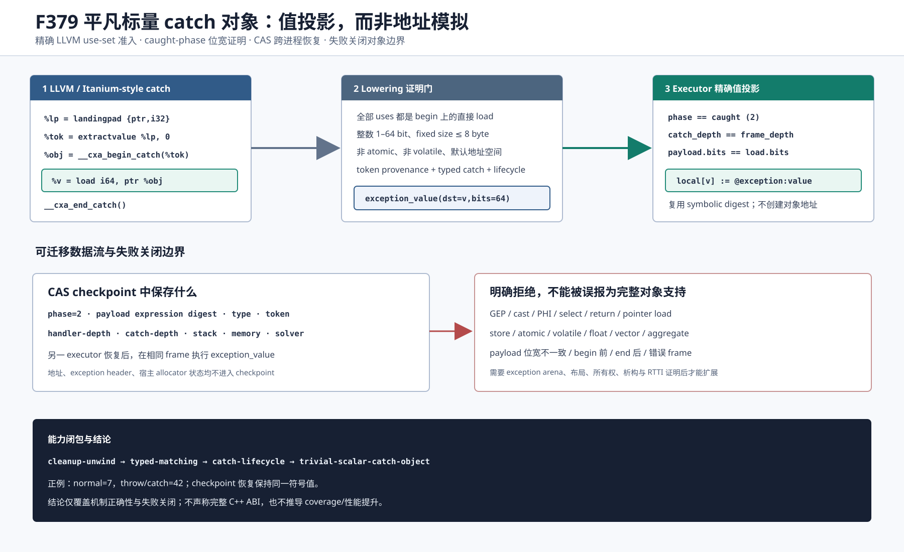

# F379：受限平凡标量 catch 对象读取

- 日期：2026-08-12
- LLVM lowering：`compiler/ContinuationLowering.cpp`
- 执行器：`util/live_continuation.py`
- 产物审计：`util/check_live_continuation_lowering.py`
- 测试：`test/live_continuation_lowering.ll`、`test/test_live_scalar_catch_object.py`
- 能力：`bounded-trivial-scalar-catch-object`
- 成熟度：I/T/E-mechanism；精确位宽、只读、单活动异常子集，不等价于 C++ exception object ABI

## 1. 研究问题与实现边界

F378 已能执行 `landingpad -> begin_catch -> end_catch/rethrow`，但要求
`__cxa_begin_catch` 的返回 pointer 无使用。真实 catch 正文即使只捕获一个平凡整数，也通常会从该 pointer
读取 payload；因此 F378 仍会拒绝最小的 catch-value 数据流。

F379 没有构造虚假的平台 exception header 或通用 heap object，而是增加一条窄而可证明的通路：只接受
`__cxa_begin_catch` 返回 pointer 上的**直接、非原子、非 volatile、1--64 bit 整数 load**。lowering 将
该 load 变为 `exception_value(dst,bits)`；执行器仅在拥有 handler 的 frame 处于 caught phase 时，将原
`throw_if` 保存的同位宽 QF_BV payload 绑定到局部 SSA 名称。其余对象操作全部失败关闭。



这是一种 continuation artifact 的 typed value projection，不是宿主地址解引用。它保留了跨进程 checkpoint
迁移能力，也避免将 Itanium exception header、allocator 地址或宿主对象布局写进持久状态。

## 2. LLVM 准入与执行次序

完整次序如下：

1. `__symcc_continuation_throw_typed_if` 产生 1--64 bit payload、精确 type identity 和非零 token；
2. unwind 逐 frame 传播，typed landingpad 的 `exception_match` 建立 matched-catch 证明；
3. landingpad index 0 经 `exception_token` 暴露为不可解引用 token；
4. 精确 ABI 的 `__cxa_begin_catch(token)` 验证 token，状态从 phase 1 进入 phase 2；
5. begin 返回值的直接整数 load 降为 `exception_value`；运行时要求当前 depth 等于 catch-depth，且
   payload expression 的 bit width 与 load 完全一致；
6. `exception_end_catch` 清除全部异常元状态，handler 才能 return。

lowering 的准入条件同时约束 producer 和所有 consumers：begin 必须仍满足 F378 的 direct declaration、C
calling convention、默认 address space、nounwind、无 bundle 和 token provenance；begin 至少有一个
consumer，且**每个** consumer 都必须是以 begin 本身为 pointer operand 的受支持 load。由此排除部分合法
load 与部分逃逸混合使用所造成的能力误判。

| 输入形态 | F379 处理 | 原因 |
| --- | --- | --- |
| `load i64, ptr %begin_result` | 接受并降为 `exception_value(bits=64)` | 直接、平凡、固定宽度、只读 |
| `load i1` 到 `load i64` | 接受，运行时做 exact-width 检查 | artifact 不猜测截断或扩展 |
| GEP 后 load | 拒绝 | 没有对象大小、字段布局或 adjusted pointer 证明 |
| `ptrtoint`、bitcast/addrspacecast、PHI、select、return | 拒绝 | pointer 会物化或逃逸 |
| store、atomic load、volatile load | 拒绝 | 需要对象身份、内存序或可观察副作用语义 |
| float/vector/aggregate/pointer load | 拒绝 | 当前 payload 仅是 1--64 bit QF_BV scalar |
| load 位宽与 throw payload 不同 | 运行时拒绝 | 不隐式 reinterpret、truncate 或 extend |

## 3. Capability 与 artifact 契约

新操作的 schema 精确为：

```json
{"op":"exception_value","dst":"payload","bits":64}
```

不允许额外字段、空 destination、布尔伪装整数或 0/大于 64 的位宽。program 声明
`bounded-trivial-scalar-catch-object` 时，必须同时声明
`bounded-exception-catch-lifecycle`、`bounded-cleanup-exception-unwind` 和
`bounded-typed-exception-matching`，并且代码中至少出现一个 `exception_value`；反向地，操作存在而能力
缺失也会拒绝。compiler 和 executor 分别验证同一闭包，手工编辑 JSON 不能单靠 capability 字符串启用语义。

运行时不新增对象地址。`exception_value` 读取 `@exception:value`，验证：

- `@exception:phase == 2`；
- `@exception:catch-depth == current frame depth`；
- payload 存在且 expression `bits` 与操作完全相等。

验证成功后直接复用不可变 symbolic expression digest，因此 checkpoint 仍由现有 content-addressed store
保存。暂停在 begin 后、value 前的 caught checkpoint，可由新的 executor 实例恢复并得到相同 payload。

## 4. 多轮 review 与修复

1. **能力闭包 review**：首轮 fixture 使用 catch-all，但只声明 cleanup/lifecycle/scalar 三项能力，验证器先
   按设计报 typed capability 缺失。修复 fixture 后，又把 scalar -> typed 依赖加入生产验证器，使手工
   artifact 与 compiler 输出具有相同闭包。
2. **对象逃逸 review**：准入从“存在一个合法 load”收紧为“begin 的非空 use set 全部是直接合法 load”；
   `ptrtoint`、GEP、store 和 mixed-use 不可能被旁路接受。
3. **内存语义 review**：明确拒绝 atomic/volatile 与非整数类型，避免把值投影误称为真实 object memory。
4. **阶段与 frame review**：增加 value-before-begin、value-after-end 和 fresh-executor checkpoint 测试；三者
   分别证明时序拒绝、销毁拒绝和迁移保持。
5. **位宽 review**：编译端限制 1--64 bit fixed scalar，运行端要求 payload exact width；不执行 C/C++
   隐式转换，从而避免符号表达式被静默截断。
6. **LLVM 负例 review**：新增 GEP、store、atomic load 以及已有 `ptrtoint` 反例；完整
   `live_continuation_lowering.ll` 同时验证成功路径值集合与失败诊断。

## 5. 验证结果与结论边界

最终证据位于
[`evidence/f379-trivial-scalar-catch-object-2026-08-12/`](../evidence/f379-trivial-scalar-catch-object-2026-08-12/)：

- LLVM 17/18 插件重建通过；
- 完整 lit：237 passed、1 unsupported、0 failed，共 238 discovered；
- 定向 Python：30 passed、27 subtests passed；
- capability-closed Python gate：868 个规范 node ID，零 skip/xfail/xpass/deselection/漂移；
- 正例 artifact 在正常路径返回 7、异常路径返回 42；GEP/store/atomic/object-pointer 反例均拒绝；
- ruff、py_compile、diff whitespace、SVG/XML 和 PNG 渲染检查通过。

上述结果证明机制实现、恢复一致性和失败关闭边界，不证明 coverage、throughput、求解耗时或漏洞发现率提升。
F379 减少了 continuation 化真实 C++ catch 时的一类语义拒绝，但总体收益必须在后续公开 benchmark 的多重复
交互消融中测量。

## 6. 尚未实现

- `__cxa_allocate_exception`/`__cxa_throw`、异常对象 arena、header 和所有权；
- struct/class/array/float payload，字段 GEP、引用/指针 catch 和写操作；
- 非平凡析构、handler count、caught stack、`exception_ptr` 和嵌套活动异常；
- RTTI 继承、multiple-inheritance adjusted pointer 和 personality search/action record；
- Windows funclet、foreign exception 及完整 Itanium/ARM ABI 对拍。

下一阶段应实现带 generation、size、type 和 ownership 证书的 bounded exception arena；只有 native replay
验证构造、adjusted catch pointer、析构和重抛引用计数后，才可扩大“异常对象支持”的表述。
