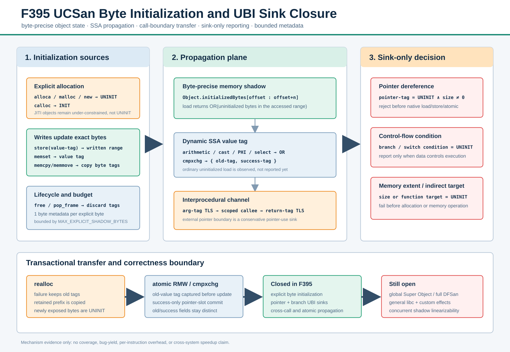

# F395：UCSan 字节级初始化传播与 UBI sink 闭环

> 日期：2026-08-13  
> 前置能力：F393 可恢复 JITI 上下文、F394 显式对象 OOB/UAF  
> 论文依据：UCSan，OSDI 2026，§3.4 Memory Safety Checkers  
> 官方实现对照：`R-Fuzz/UCSan` commit `fb524c7bdf1663f2d78a94399ff6583a05bdbe6b`  
> 实现：`compiler/UCSan.cpp`、`runtime/src/UCSanRuntime.cpp`  
> 回归：`test/ucsan_uninitialized.c`、`benchmark/benchmark_ucsan_uninitialized.py`



## 1. 研究问题与结论

F394 已能区分 under-constrained JITI object 与程序显式分配的 stack/heap object，并对后者执行严格
allocation bounds 与生命周期检查，但它没有回答“对象中的哪些字节已经由程序定义”。若只给整个对象设置一个
布尔标记，则结构体的局部写入、短 `memcpy`、`realloc` 保留前缀和 pointer slot 都会失去精度。

F395 为每个显式对象增加逐字节初始化状态，并把内存状态提升为动态 SSA value tag，再通过函数调用通道传播。
检查器采用 **sink-only** 策略：读取未初始化字节本身只产生 tag；仅当 tag 到达指针解引用、控制流条件、间接目标
或内存长度时拒绝执行。该策略与 UCSan 论文 §3.4 的核心 UBI 语义一致，同时避免把所有普通 load 都误判为缺陷。

准确的能力结论是：F395 关闭了 scoped C/C++ 显式 stack/heap 对象的 byte-level initialization、跨 SSA/调用边界
传播，以及 pointer/branch 核心 UBI sink。它不是完整 DFSan 或完整 UCSan：global Super Object、一般 libc/custom
effect、跨线程原子影子线性化和论文公开 benchmark 复现仍未关闭。

## 2. 论文语义到工程实现的映射

| 论文语义 | F395 实现 | 明确边界 |
| --- | --- | --- |
| explicit allocation 初始为 UNINIT | `alloca`、malloc、常见 new 注册全 0 byte tag | JITI object 不标 UNINIT |
| 零初始化 allocation | calloc 注册全 1 byte tag | 自定义零化 allocator 需 effect model |
| write 清除 UNINIT | store/memset 按写入范围更新 tag | 未初始化 value 写入时保持 UNINIT |
| copy 传播 | memcpy/memmove 同步复制 pointer shadow 与 byte tag | native/unknown source 视为 initialized |
| value propagation | load 汇总访问范围，cast/PHI/select/operator 传播动态 tag | aggregate 通常保守 OR，cmpxchg 字段例外 |
| interprocedural propagation | 256 槽 thread-local argument/return channel | vararg/超界参数 fail closed |
| pointer UBI | 非零访问前检查 pointer tag | 零长度 memintrinsic 不构成解引用 |
| branch UBI | branch/switch 条件前检查 | 不对普通未初始化 load 立即报告 |
| external boundary | 未建模 external 的 pointer argument 是保守 sink | scalar side effect/result 不自动建模 |

官方 UCSan 使用 DFSan-style shadow 传播。本项目没有复用固定虚拟地址 shadow map，而是把两种元数据分层：

1. `Object.initializedBytes[offset]` 保存显式对象的逐字节初始化事实；
2. LLVM pass 中的 `DenseMap<Value*, Value*>` 保存当前动态 SSA value 的一位 UNINIT tag；
3. pointer provenance 继续沿用 F393/F394 的 object shadow；
4. thread-local argument/return channel 跨越 scoped function ABI。

这样不会与 SymCC 原有符号表达式 shadow 冲突，也能对源代码级真实 stack/heap allocation 执行检查。

## 3. 执行流程

### 3.1 分配与逐字节状态

显式对象注册 ABI 变为：

```text
register_explicit(base, count, element_size, kind, frame, initialized)
```

runtime 先用 checked multiplication 得到真实字节数，再一次性分配 byte tag。`alloca`/malloc/new 传入
`initialized=0`，calloc 传入 `initialized=1`。空指针不建立 metadata；零大小对象可保留对象身份，但不消耗
byte-shadow budget。

每个 byte 只存 0/1：0 表示尚未初始化，1 表示已初始化。默认全局上限为 64 MiB，可通过
`SYMCC_UCSAN_MAX_EXPLICIT_SHADOW_BYTES` 调整；扩容前同时检查算术溢出和累计预算，失败时 fail closed。

### 3.2 load/store 与 memintrinsic

```text
load [address, address+n)
  -> 先做 F394 bounds/UAF 检查
  -> OR(范围内是否存在 UNINIT byte)
  -> 把结果附着到 load SSA value

store value -> [address, address+n)
  -> 先做 pointer sink + bounds/UAF 检查
  -> 写入 value 的动态 tag 到精确 byte 范围
  -> 同步写入或清除 pointer-slot provenance
```

`memcpy/memmove` 先检查非零长度的源/目标访问，再用临时向量复制初始化 tag，因此重叠 `memmove` 不会边写边
污染后续源区间。`memset` 用 fill value 的 tag 覆盖目标范围；通常常量 fill 已初始化，所以范围转为 initialized。
长度本身若未初始化，会在原生内存操作前命中 memory-extent sink。

若 source 不属于显式对象，runtime 无法观察其 byte provenance，复制到显式 destination 时按 initialized 处理。
这是一条可审计的模型边界，而不是声称一般 libc/全进程内存已被追踪。

### 3.3 SSA 与跨函数传播

load 产生的一位 tag 经以下规则传播：

- cast、freeze：复制 operand tag；
- arithmetic/comparison/GEP：对相关 operand 做 OR；
- select：条件 tag OR 实际选中 arm 的 tag；
- PHI：建立与原 PHI 同 predecessor 的 tag PHI；
- scoped call：调用前写 argument tag TLS，callee 入口读取；返回前写 return tag，caller 正常边读取；
- pointer shadow 与 UNINIT tag 使用独立通道，不能相互替代。

通道上限为 256 个参数。scoped function 或 call 超过上限时编译期拒绝，防止静默覆盖 TLS slot。harness 创建的
符号根值和 JITI pseudo pointer 是 under-constrained input，不等同于“程序明确分配但未初始化的字节”，因此入口
root tag 为 initialized。

### 3.4 sink-only 判定

| sink id | 触发位置 | 拒绝发生在 |
| --- | --- | --- |
| 1 | load/store/atomic pointer、indirect call/branch target、external pointer argument | 原生解引用/边界调用之前 |
| 2 | conditional branch、switch condition | 控制流提交之前 |
| 3 | alloca/allocator/memintrinsic size | 分配或内存操作之前 |

pointer sink 同时与 `size != 0` 相与，所以 `memcpy(uninit_ptr, uninit_ptr, 0)` 不因“零访问”误报；长度 tag 仍会
独立检查。free/realloc 的 old pointer 即使不执行 load/store，也属于决定对象生命周期的 pointer-use sink。

### 3.5 external call 边界

对 scope 外且没有精确 wrapper/effect 的函数，pointer argument 是保守 pointer-use sink。`arbitrary` external stub
还会通过 argument shadow 使显式对象失效，以表达未知外部副作用。审查中发现生成的
`__symcc_ucsan_stub.*` 曾被 `isUCSanRuntimeCall` 错认成 runtime helper，导致它绕过 argument shadow/TLS ABI；F395
把 runtime helper 判定收紧为仅 `_sym_ucsan_` 前缀，并增加“arbitrary external invalidation 后 alias UAF”native
回归。该修复同时保护 F394 的 external lifecycle 语义。

## 4. realloc 与原子操作

### 4.1 realloc 的初始化事务

F394 的 prepare/native/commit 生命周期事务在 F395 扩展为 byte-tag 事务：

1. native realloc 失败且请求非零：旧对象和全部 tag 保持不变；
2. 原地缩小：只保留新边界内前缀，丢弃截断 tag 与 pointer-slot shadow；
3. 原地增长：保留旧前缀，新暴露字节标为 UNINIT；
4. 搬迁：复制 `min(old_size,new_size)` 的 byte tag 与完整 pointer slots，旧对象成为 tombstone；
5. `realloc(p,0)` 返回 null 时按释放提交。

先保存 retained initialization，再失效旧 object，避免 `markExplicitFreed` 清空 vector 后丢失迁移事实。

### 4.2 atomic RMW/cmpxchg

单线程/无并发竞争的 metadata 语义为：

- atomic RMW 的返回 tag 是更新前 memory tag；xchg 后 slot tag 等于 new value，其余 RMW 为 old OR operand；
- pointer 经 LLVM integer lowering 后仍用 `load_stored_shadow` 恢复旧 provenance；
- cmpxchg 的 `{old, success}` 两个字段分别传播：old 只继承旧 memory tag，success 还依赖 compare tag；
- pointer-slot shadow 仅在 native cmpxchg 成功时提交，失败保留旧 slot shadow；
- atomic pointer exchange 把 new pointer shadow 写回并把 old shadow附着到返回值。

原子机器操作与 runtime metadata hook 是两个调用，跨线程观察时目前不能保证二者组成一个线性化事务。因此测试
证明的是单线程和数据竞争自由路径下的精确转移，不宣称 concurrent shadow linearizability。

## 5. ABI 与不变量

新增/扩展 ABI：

| ABI | 作用 |
| --- | --- |
| `_sym_ucsan_register_explicit(..., initialized)` | 建立显式对象及 byte tag |
| `_sym_ucsan_load/store_uninitialized` | 读取范围 OR、写入精确范围 |
| `_sym_ucsan_check_initialized` | 在三类 sink 上统一 fail closed |
| `_sym_ucsan_set/get_argument_uninitialized` | 跨 scoped call 传播参数 tag |
| `_sym_ucsan_set/get_return_uninitialized` | 跨正常返回边传播 tag |
| `_sym_ucsan_load_stored_shadow` | 从整数化 atomic slot 恢复 pointer provenance |
| `_sym_ucsan_store_shadow_conditional` | cmpxchg success-only pointer commit |

必须保持的状态不变量：

1. `explicitShadowBytes == sum(live explicit initializedBytes.size())`；
2. freed object 的 byte vector 为空且不再计入预算；
3. 范围操作先通过 F394 exact bounds/UAF check，vector iterator 永不越界；
4. byte tag 与 pointer provenance 独立更新，但 `memcpy/realloc/atomic` 必须同时迁移；
5. JITI object 没有 `initializedBytes`，不能被错误报告为 UBI；
6. 普通未初始化 load 只传播，直到 sink 才报告；
7. 非零伪造 shadow、参数通道越界和预算溢出一律 fail closed。

## 6. 自动化测试与证据

### 6.1 28 个 native mode

`ucsan_uninitialized.c` 在真实 LLVM instrumented executable 中覆盖 28 个 mode：

- 12 个合法场景：malloc 写后读、calloc、memset、覆盖清除、realloc shrink、pointer slot、普通 atomic、
  pointer cmpxchg success/failure、atomic pointer exchange、零长度 memcpy、已初始化 stack；
- 16 个拒绝场景：heap/stack branch UBI、heap/stack pointer UBI、copy propagation、scalar copy、跨函数 scalar/
  pointer return、realloc growth、memory extent、store propagation、PHI、atomic RMW、cmpxchg success condition、
  external pointer sink、arbitrary external invalidation UAF。

每个 mode 执行 11 次，共 **308/308 expected outcomes matched**。12 个合法 mode 始终 exit 0，16 个违反 mode
始终产生指定诊断。abort 路径延迟含信号投递与主机 core handler，不能解释单条 checker 的开销。

### 6.2 最终门禁

| 门禁 | 结果 |
| --- | --- |
| LLVM 18 UCSan 定向 | 10/10 passed |
| LLVM 17 UCSan 定向 | 10/10 passed |
| Python canonical gate | 954 passed + 235 subtests；954/954 nodeid 精确一致 |
| LLVM 18 完整 lit | 256 passed + 1 个既有 unsupported；共 257 项 |
| native 机制矩阵 | 28 modes × 11 samples = 308/308 matched |
| 静态门禁 | Ruff、Python format、py_compile、`git diff --check` 通过；环境无 clang-format |

完整输出、环境、源码合同、上游版本和 SHA-256 清单位于
[`f395-ucsan-byte-initialization-ubi-2026-08-13`](../evidence/f395-ucsan-byte-initialization-ubi-2026-08-13/)。

## 7. 多轮 review 发现与修复

### 第一轮：byte-range 与生命周期

- 用逐字节 vector 替代 allocation-level 单 bit，消除局部写入误清整对象的问题；
- `memmove` 先复制到临时 vector，保证重叠语义；
- realloc failure、retained prefix、growth tail 分开提交；
- free/pop_frame 同时回收初始化 shadow 预算。

### 第二轮：IR 与 ABI

- 修复 external stub 被错误归类为 runtime helper，恢复 argument shadow/TLS instrumentation；
- argument/return channel 增加 256 槽编译期边界；
- zero-size memory operation 不再触发虚假的 pointer dereference；
- scoped stack allocation 增加 branch/pointer UBI 反例，证明能力不局限于 heap。

### 第三轮：atomic 与字段精度

- 为整数化 atomic pointer slot 增加 stored-shadow 读取；
- cmpxchg 改为 success-only pointer shadow commit；
- `{old,success}` 不再共享一个保守 aggregate tag，分别记录字段依赖；
- 明确记录 metadata hook 与 native atomic 非线性化的并发边界。

## 8. 未关闭项与研究优先级

1. **global Super Object**：全局变量、TLS、constructor initialization order 尚未进入 byte tag；
2. **一般 effect system**：read/write/initialize/copy/allocate/free 的 YAML 参数化 effect，而非仅 wrapper rename；
3. **full DFSan propagation**：vector/aggregate/intrinsic/inline asm 与跨未 instrumented DSO 的完整数据流；
4. **并发 metadata transaction**：atomic value 与 pointer/UNINIT shadow 的同序、同原子提交；
5. **复杂生命周期**：stackrestore、setjmp/longjmp、coroutine/fiber、Windows funclet；
6. **公共实验**：UCSan nbench/UBITect、LAVA-M 或等价 target 的等 CPU、重复 campaign bug-yield/TTF；
7. **性能工程**：稀疏区间/分层 shadow、批量 hook、线程局部 cache 与 per-instruction overhead 分解。

因此 F395 的成熟度为 **I/T/E-mechanism**。它证明机制和回归闭环，不证明 coverage、漏洞产出或跨系统 speedup。

## 9. 复现命令

```bash
cmake --build build -j16
cmake --build build-llvm17 -j16
lit -v -j8 --filter='ucsan' build/test
lit -v -j8 --filter='ucsan' build-llvm17/test
lit -v -j16 build/test

python3 benchmark/benchmark_ucsan_uninitialized.py \
  build/test/Output/ucsan_uninitialized.c.tmp \
  --samples 11 --output f395-mechanism.json
```

## 10. 参考文献

1. Yin, M. et al. [A Compilation-Based Under-Constrained Execution Engine](https://www.usenix.org/system/files/osdi26-yin.pdf), OSDI 2026.
2. R-Fuzz. [UCSan official implementation](https://github.com/R-Fuzz/UCSan), audited at commit `fb524c7bdf1663f2d78a94399ff6583a05bdbe6b`.
3. LLVM. [DataFlowSanitizer Design](https://clang.llvm.org/docs/DataFlowSanitizerDesign.html).
4. LLVM. [Atomic Instructions](https://llvm.org/docs/LangRef.html#atomic-memory-ordering-constraints).
5. ISO C / The Open Group. [`realloc`](https://pubs.opengroup.org/onlinepubs/9799919799/functions/realloc.html).
