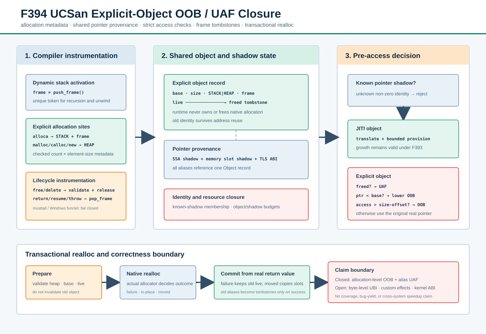

# F394：UCSan 显式对象 OOB/UAF 检查闭环

> 日期：2026-08-13  
> 上一能力：F393 可恢复 JITI 对象上下文  
> 论文依据：UCSan，OSDI 2026，§3.4 Memory Safety Checkers  
> 官方实现对照：`R-Fuzz/UCSan` commit `fb524c7bdf1663f2d78a94399ff6583a05bdbe6b`  
> 实现：`compiler/UCSan.cpp`、`runtime/src/UCSanRuntime.cpp`  
> native 回归：`test/ucsan_explicit_objects.c`、`test/ucsan_explicit_cpp.cpp`、
> `test/ucsan_explicit_unwind.cpp`



## 1. 研究问题与准确结论

F393 已能为 under-constrained pointer 创建 JITI backing object，并把 root、point-by path、alias class 和
运行态对象内容保存为可重放快照。但是，旧 `_sym_ucsan_check` 对所有带 shadow 的指针都执行有界扩容：这一
语义适用于尚未存在的 under-constrained 对象，却不适用于程序自己明确分配的 stack/heap 对象。若把
`int a[2]; a[2]=...` 当成 JITI growth，checker 会扩容并掩盖真正的越界。

F394 引入不可混淆的两类对象：

| 对象类别 | 来源 | 越界时的语义 | 生命周期 |
| --- | --- | --- | --- |
| JITI object | root/pointer path 第一次解引用 | 在预算内向 lower/upper 扩容 | 可 invalidate、可快照重放 |
| explicit stack | scoped LLVM `alloca` | 访问必须完全落在原 allocation bounds 内 | 所属 frame 退出后成为 tombstone |
| explicit heap | C/C++ allocator 返回值 | 访问必须完全落在原 allocation bounds 内 | `free/delete` 或成功搬迁的 `realloc` 后成为 tombstone |

因此本功能关闭的是论文 §3.4 中 **allocation-level OOB** 和 **alias-preserving UAF** 的核心执行语义。
它不是完整 UCSan checker 复现：逐字节 UNINIT/branch sink UBI、自定义 allocator effect mapping、Windows
funclet、`longjmp` 和 kernel allocator wrapper 仍在边界之外。

## 2. 论文语义与本项目映射

论文要求显式 stack/heap 分配记录 base 与 size，并由 pointer shadow 把所有 alias 关联到同一个 metadata；
每次内存访问先查 bounds/freed flag。栈对象在函数退出时失效，heap 对象在显式 deallocation 时失效。F394
按这一关系实现，但没有复制官方 DFSan 固定地址 shadow map：本项目继续使用已有 pointer SSA shadow、
memory-shadow interval table 和 thread-local call channel，以避免与 SymCC 自身符号 shadow 冲突。

| 论文概念 | F394 对应实现 | 审计边界 |
| --- | --- | --- |
| explicit allocation metadata | `Object{explicitAllocation, kind, size, frame, freed}` | allocation-level，不做 struct field type safety |
| pointer metadata propagation | 既有 GEP/cast/phi/select/call/memory shadow 通道 | 不支持未建模 ABI 或 asm 内的传播 |
| stack allocation | 每个 scoped `alloca` 后注册 `count × element_size` | scalable alloca、stackrestore 精细生命周期未单列 |
| heap allocation | malloc/calloc/aligned_alloc/reallocarray 与常见 Itanium new 家族 | 自定义 allocator 仍需 wrapper/effect contract |
| OOB sink | load/store/atomic/memintrinsic 前的 `_sym_ucsan_check` | 外部 libc 内部访问依赖 wrapper，而非本 pass 观察 |
| UAF sink | freed tombstone 在 `_sym_ucsan_check` 中先于访存拒绝 | 地址复用不会复活旧 shadow |
| stack exit | return、Itanium `resume`、无 cleanup 的直接 throw/rethrow | Windows funclet 与 musttail 编译期 fail closed |

## 3. 编译与执行次序

### 3.1 scoped function 入口

每次动态调用先执行 `_sym_ucsan_push_frame()`，得到全局唯一的 64-bit frame token。递归调用不能只按函数
GUID 标识，否则同一函数的两层 activation 会相互失效；token 因而按动态 activation 分配。原有 entry
argument shadow channel 随后读取，不改变 harness ABI。

### 3.2 allocation registration

1. `alloca T, count` 执行后调用 `register(base,count,sizeof(T),STACK,frame)`；
2. malloc/new/aligned_alloc 成功返回后调用 `register(base,1,size,HEAP,0)`；
3. calloc 记录 `count × element_size`，乘法在 runtime 用 checked arithmetic 重算；
4. 空分配返回 `nullptr` 时不创建伪 metadata；
5. object/shadow 总数继续服从 F393 的资源预算。

每个 explicit object 建立一个 `PointerShadow`。该 shadow 随 SSA pointer 传播；指针写入内存时，已有
`store_shadow/copy_shadow/load_shadow` 使 alias 在 struct、局部变量和 `memcpy` 之后仍指向同一 object。

### 3.3 access decision

```text
memory operation(pointer, shadow, size)
  -> shadow 是否为 runtime 已发行身份？否且非零：fail closed
  -> shadow.object 是 explicit？
       freed == true              -> UAF，原访存不执行
       pointer < base             -> lower-bound OOB
       offset > size              -> upper-bound OOB
       access > size - offset     -> crossing OOB
       otherwise                  -> 返回原生 real pointer
  -> shadow.object 是 JITI？       -> F393 pointer translation + bounded provision
  -> shadow 为零但地址命中 explicit table？ -> 同样严格检查
  -> 其他 native pointer          -> 原样通过
```

减法形式 `access > object_size - offset` 避免 `offset + access` 的无符号溢出。零长度 memintrinsic 不构成
访存，不会仅因 tombstone 产生误报。非零未知 shadow 不能通过地址查表回退被“洗白”。

### 3.4 heap release

`free/delete` 在原生 deallocator 调用**之前**验证：对象必须为 heap、指针必须等于 allocation base、对象必须
仍为 live。验证通过后写 `freed=true` 并清除释放区间内部保存的 pointer slots；外部 alias 的 shadow 不被
删除，正是后续 UAF 检测所需的 tombstone。double free、stack free 和 interior free 都在进入 libc 前拒绝。

### 3.5 realloc 两阶段事务

`realloc` 不能复用 free 的预先失效方案：失败返回 `nullptr` 时，C 语义要求旧对象继续有效。F394 因而采用：

1. **prepare**：调用前只验证 old pointer 的 heap/base/live 条件；
2. 执行原生 realloc/reallocarray；
3. **commit-failure**：非零请求失败时返回 zero shadow，旧 metadata 保持 live；
4. **commit-in-place**：地址不变时只更新 bounds，并恢复同一 object 的 shadow；
5. **commit-move**：注册新 object，把完整落入交集范围的 pointer-slot shadow 搬到新地址，再把旧 object
   变为 tombstone；
6. `reallocarray` 乘法溢出并返回失败时同样保留旧对象，不能在 post-commit 阶段误报。

这使 concrete allocation transaction 和 shadow transaction 在返回值边界上同步。

## 4. 栈退出与异常语义

正常 return 在设置 pointer return shadow 后执行 `pop_frame`。若返回的是局部对象地址，caller 能收到同一
shadow，但该 object 已处于 freed 状态，第一次实际访问报告 stack-use-after-return。

Itanium C++ 有两类退出：

- 有 cleanup/destructor：Clang 生成 landingpad 与 `resume`，在 `resume` 前 pop；
- 无 cleanup：直接调用 noreturn `__cxa_throw/__cxa_rethrow/_Unwind_*`，在调用前 pop。

这一区分避免在 destructor 运行前过早失效栈对象。Windows funclet 需要 funclet operand bundle，普通 call
不能合法插在 `catchswitch/cleanupret` 前；当前遇到这些 IR 时编译期拒绝。`musttail` 也必须保持 call 与 ret
相邻，因此同样 fail closed，而不是生成违反 LLVM verifier 的 IR。

## 5. ABI 与状态不变量

| ABI | 含义 |
| --- | --- |
| `_sym_ucsan_push_frame/pop_frame` | 建立/提交动态 stack activation 生命周期 |
| `_sym_ucsan_register_explicit` | 原子验证 size/kind/frame/budget 并发行 object shadow |
| `_sym_ucsan_release_explicit` | free/delete 前验证并写 heap tombstone |
| `_sym_ucsan_validate_reallocate` | realloc prepare，只验证不失效 |
| `_sym_ucsan_reallocate_explicit` | 根据真实返回值提交 failure/in-place/move |
| `_sym_ucsan_check` | 统一分派 explicit strict check 与 JITI provision |

关键不变量：

1. runtime 只解引用 `knownShadows` 集合中的 shadow；
2. explicit object 永不由 runtime `free`，避免 object destructor 二次释放程序内存；
3. freed object 保留身份但不会进入 F393 structured snapshot；
4. 同地址新分配可更新 address fallback，旧 alias 仍通过旧 shadow 指向 tombstone；
5. frame token 只能 pop 一次，inactive frame registration 与重复 pop 均拒绝；
6. JITI 总物化字节预算不重复计算程序自己的 native heap。

## 6. 自动化与 native 证据

### 6.1 端到端场景

`ucsan_explicit_objects.c` 在同一真实 instrumented executable 中覆盖：

- 合法 stack、malloc、calloc、realloc 与 free；
- stack 上/下界 OOB、heap/calloc OOB、跨边界 memcpy；
- heap alias UAF、stack-use-after-return、double free、stack free；
- realloc 失败保留旧对象；
- realloc 后 pointer-slot shadow 保持；
- reallocarray size overflow 失败保留旧对象；
- realloc 扩缩后的尺寸变化区间不会保留旧 pointer-slot shadow。

`ucsan_explicit_cpp.cpp` 覆盖 new[]/delete[] 的合法、OOB 和 alias UAF；
`ucsan_explicit_unwind.cpp` 分别执行有 cleanup 的 `resume` 和无 cleanup 的直接 throw，二者均形成可检测的
stack-use-after-return。`ucsan_unsupported_musttail.ll` 验证不兼容 IR 在编译期拒绝。

### 6.2 机制基准

14 个 C native mode 每个执行 11 次，共 **154/154 outcome matched**：5 个合法 mode 全部 exit 0，9 个
违反 mode 全部返回预期的 OOB/UAF/deallocation 诊断。每行还保留 whole-process median/P95；abort 路径
包含进程信号和本机 core-handler 成本，不能拿它解释单次 check 指令成本。

该基准只证明 checker 机制的确定性和完整触发，不证明 coverage、漏洞产出、solver 性能或跨系统 speedup。
公开 target 的等 CPU bug-yield 实验仍必须单独进行。

### 6.3 完整回归门禁

| 门禁 | 最终结果 |
| --- | --- |
| Python canonical gate | 954 passed + 235 subtests；954/954 nodeid 精确一致，零 skip/xfail/xpass/deselect |
| LLVM 18 UCSan 定向 | 9/9 passed |
| LLVM 17 UCSan 定向 | 9/9 passed |
| LLVM 18 完整 lit | 255 passed + 1 个既有 unsupported；共发现 256 项 |
| 机制矩阵 | 14 modes × 11 samples，154/154 outcome matched |
| 静态门禁 | Ruff、format check、py_compile、`git diff --check` 全部通过 |

完整原始输出、环境、论文/官方仓库版本、源码合同和 SHA-256 清单位于
[`f394-ucsan-explicit-object-checkers-2026-08-13`](../evidence/f394-ucsan-explicit-object-checkers-2026-08-13/)。

## 7. 三轮审查结论

### 第一轮：对象语义

- 修复把 explicit OOB 当作 JITI growth 的类别混淆；
- 保留 lower-bound 和 crossing access 检查；
- object metadata 与实际 native allocation ownership 分离。

### 第二轮：生命周期与事务

- free 前验证，避免 libc 先执行 invalid/double free；
- realloc 由单步失效改为 prepare/commit，失败路径保持旧对象；
- reallocarray overflow 的 native failure 不再误报；
- moved realloc 迁移 pointer-slot shadow 并保留旧 alias tombstone。
- 原地 realloc 扩缩会清空尺寸变化区间，避免旧 pointer-slot shadow 泄漏到新语义范围。
- address fallback 在历史 freed 区间与当前 live 区间重叠时优先选择 live object；只有无 live match
  时才选择最新 tombstone，避免 allocator/stack 地址复用造成伪 UAF。

### 第三轮：ABI 与控制流

- 增加 known-shadow membership，拒绝伪造 shadow；
- 覆盖递归 frame、正常 return 和两类 Itanium unwind；
- musttail/Windows funclet 明确 fail closed；
- C++ new/delete 族不再因默认 pure external policy 被替换成 stub。

## 8. 尚未关闭的论文语义

1. 逐字节 `UNINIT` tag、pointer-dereference 与 branch-condition 两类 UBI sink；
2. global variable 自动进入 Super Object 与初始化顺序；
3. YAML custom allocator 的参数/返回/effect 映射，而不只是同类型 wrapper rename；
4. nothrow/placement/custom C++ allocation ABI 的完整覆盖；
5. Windows funclet、setjmp/longjmp、fiber/coroutine 和 stackrestore 生命周期；
6. fixed-address sanitizer shadow mapping及其大规模并发成本；
7. Linux kernel kmalloc/kfree wrapper、module/LTO 和论文 nbench/UBITect 复现；
8. 与 Thoroupy/SymSan 同口径等 CPU、重复 campaign 的 bug-yield/TTF 结论。

因此 F394 的准确成熟度是 **I/T/E-mechanism**，不是完整 UCSan 复现，也没有 R 级公开效果结论。

## 9. 复现命令

```bash
cmake --build build -j8
cmake --build build-llvm17 -j8
lit -v -j8 --filter='ucsan' build/test
lit -v -j8 --filter='ucsan' build-llvm17/test

python3 benchmark/benchmark_ucsan_explicit_objects.py \
  build/test/Output/ucsan_explicit_objects.c.tmp \
  --samples 11
```

## 10. 参考文献

1. Yin, M. et al. [A Compilation-Based Under-Constrained Execution Engine](https://www.usenix.org/system/files/osdi26-yin.pdf), OSDI 2026.
2. R-Fuzz. [UCSan official implementation](https://github.com/R-Fuzz/UCSan), audited at commit `fb524c7bdf1663f2d78a94399ff6583a05bdbe6b`.
3. LLVM. [DataFlowSanitizer Design](https://clang.llvm.org/docs/DataFlowSanitizerDesign.html).
4. LLVM. [Exception Handling in LLVM](https://llvm.org/docs/ExceptionHandling.html).
5. ISO C / The Open Group. [`realloc`](https://pubs.opengroup.org/onlinepubs/9799919799/functions/realloc.html).
