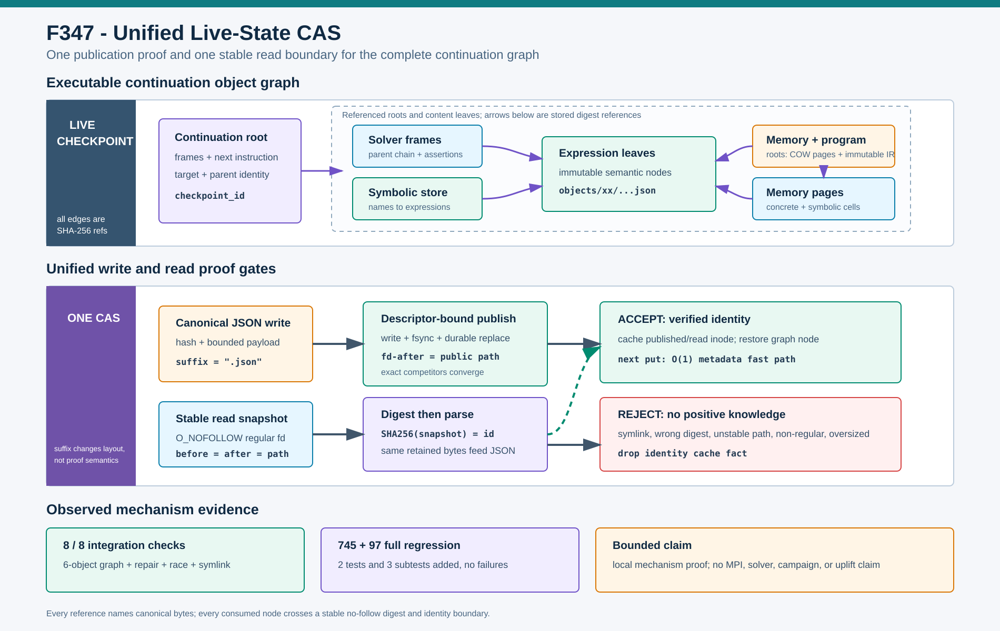

# F347：Unified Live-State CAS and Stable Snapshot Reads

> 功能编号：`F347`  
> 日期：`2026-08-10`  
> 状态：已实现，故障注入与完整回归验证完成



## 1. 研究背景

项目的 live continuation 将一次未完成的符号执行保存为内容寻址对象图。一个 checkpoint 并非单个
JSON 文件，而是由 continuation descriptor 引用 program、solver-frame chain、symbolic store、COW
memory root 和 memory pages；frame 与 page 又引用表达式对象。恢复时必须证明每个对象的字节都与名称中
的 SHA-256 一致，否则错误对象可能改变路径条件、符号变量、内存或下一条待执行指令。

F345/F346 已把 hybrid 输入 CAS 提升为稳定 no-follow 读取和 descriptor-bound 发布事务，但
`LiveStateStore` 仍维护了一套更弱的重复实现：

1. `_put_mapping()` 先调用 `os.path.isfile(path)`；该 API 跟随符号链接，而且只证明目标“是文件”，
   不证明内容摘要；
2. 一旦名称存在便直接返回对象 ID，损坏文件或指向根外精确内容的 symlink 都可被当成已发布对象；
3. 写入使用独立的 temporary + `durable_replace` 流程，没有 F346 的写 fd、公开名称和竞争 writer 闭环；
4. `_get_mapping()` 用普通 `open(path)` 跟随名称，并在读完后不比较 fd/path identity；读取过程中发生
   replace 时，消费字节与最终名称可能不是同一对象；
5. live-state 和 hybrid-input CAS 的修复、并发、缓存与失败语义会随代码演进继续分叉。

这类问题不要求哈希碰撞。根因是“文件名看起来像摘要”被误当成“字节已经由摘要证明”。

## 2. 目标与不变量

F347 保持现有磁盘布局和外部 checkpoint ID 不变，同时建立统一对象不变量。令 `h` 为对象 ID，`P_h`
为其公开路径，`S(P_h)` 为稳定 no-follow snapshot：

```text
layout(P_h) = objects / h[0:2] / (h[2:] + ".json")
regular(P_h)
SHA256(bytes(S(P_h))) = h
identity(fd_before) = identity(fd_after) = identity(path_after)
```

读取只有在四项同时成立后才解析 JSON。写入则复用 F346 的两级提交：

```text
uncontended:
  written-fd content fields stable AND published-fd identity = public-path identity

competition observed:
  stable_no_follow_sha256(current public regular file) = h
```

竞争者是不同 inode 并不自动意味着错误；同摘要 writer 可以幂等收敛。错误摘要、symlink、非普通对象、
消失、超限或读取期间变化一律失败关闭。

## 3. 架构修改

### 3.1 后缀感知的统一 CAS

`ContentAddressedInputStore` 新增 keyword-only `object_suffix`：

- 默认空串，hybrid input 的原布局完全不变；
- live state 使用 `.json`，保持历史 checkpoint 路径兼容；
- 后缀必须是字符串，不能包含主/备用路径分隔符或 NUL；
- 后缀只能附加到 64-hex digest 的 leaf，不能改变 shard 或逃逸根目录。

`LiveStateStore` 在初始化时构造一个
`ContentAddressedInputStore(objects_root, max_object_bytes, object_suffix=".json")`。
所有 `_put_mapping()` 调用统一进入该实例，因此 expression、program、frame、symbolic store、page、memory
root 和 continuation descriptor 共享同一发布协议。

### 3.2 写路径：删除 existence-is-valid

旧路径的 `isfile -> return` 被完全删除。现在即使对象名称已经存在，也必须满足：

1. 最终组件 no-follow 类型为 regular file；
2. identity cache 命中，或稳定 SHA-256 等于对象 ID；
3. 若验证失败，调用方提供的 canonical exact bytes 通过 F346 writer 原子修复；
4. 写 fd 保持跨越 durable replace，发布后 fd/path 身份闭合；
5. 正确竞争 writer 经一次稳定摘要仲裁收敛，错误竞争者不进入 cache；
6. 所有退出路径清理本次 temporary 名称。

因此“精确内容 symlink 已存在”不再被视为 cache hit。发布会替换 symlink 本身，不读取或修改其外部目标。

### 3.3 读路径：消费一次稳定快照

`_get_mapping()` 不再普通 `open()`。它调用 `stable_regular_file_snapshot(..., retain_content=True)`：

1. `O_RDONLY | O_NOFOLLOW | O_NONBLOCK | O_CLOEXEC` 打开最终组件；
2. `fstat` 要求 regular file，且 metadata size 不超过 `max_object_bytes`；
3. 固定 1 MiB 窗口同时计算 SHA-256 并保留将被 JSON parser 消费的同一组字节；
4. 读后再次 `fstat`，再对最终路径做 no-follow `stat`；
5. 要求读取长度、fd 前后完整 identity 和 path-after identity 全部一致；
6. 摘要等于对象 ID 后才解析 ASCII JSON 并检查 schema。

这里保留内容不会增加重复 I/O：JSON 本来就必须进入内存解析；F347 只是让“哈希的字节”和“解析的
字节”来自同一个已闭合 snapshot。峰值仍受 `max_object_bytes` 限制。

### 3.4 正向身份缓存状态机

统一 CAS 新增 `_remember_verified_identity()`，集中执行 300,000 项 clear-on-overflow 策略：

| 事件 | cache 状态 |
| --- | --- |
| 发布后 fd/path 闭合 | 记录公开 inode identity |
| 稳定读取且摘要匹配 | 记录 snapshot identity |
| metadata 与已缓存 identity 相同 | 后续 put 走 O(1) metadata fast path |
| snapshot 打开/类型/身份/上限失败 | 删除该对象旧 identity |
| snapshot 摘要与对象 ID 不同 | 删除该对象旧 identity |
| 检测到发布竞争 | 先删除旧事实，再摘要仲裁 |

读取仍是 `O(object_bytes)`，因为调用方需要 JSON bytes；缓存优化的是后续重复 put，而不是跳过读取验证。

## 4. 完整执行流程

### 4.1 保存 continuation

1. 每个结构先转为 canonical ASCII JSON；
2. 在写副作用前计算 SHA-256 并检查对象大小；
3. 根据 digest 和 `.json` suffix 得到兼容路径；
4. 已存在对象必须通过统一 CAS 验证；否则写入、fsync、durable replace 和发布身份闭合；
5. 上层对象只引用已经可稳定读取且 schema 正确的子对象；
6. descriptor 的 canonical digest 必须等于 `checkpoint_id()`。

### 4.2 恢复 continuation

1. 以 checkpoint ID 稳定读取 descriptor；
2. 逐层稳定读取 solver frame chain，并验证 depth、父链接和表达式引用；
3. 稳定读取 symbolic store，并验证每个表达式对象；
4. 稳定读取 memory root/page，验证 page size、地址范围和 symbolic cell；
5. 只有完整图可达且 schema/摘要一致时构造 `LiveContinuationBundle`。

路径替换、symlink 或损坏会在对应节点立即失败，不能把部分恢复状态交给执行器。

## 5. 实现位置与兼容性

核心实现位于 `util/distributed_state.py`：

- `ContentAddressedInputStore.__init__/object_path`：受控 leaf suffix；
- `ContentAddressedInputStore._remember_verified_identity`：统一 cache admission；
- `LiveStateStore.__init__/object_path`：组合统一 CAS，保留 `.json` namespace；
- `LiveStateStore._put_mapping`：canonical bytes 直接调用 CAS `put`；
- `LiveStateStore._get_mapping`：稳定 snapshot、摘要检查、cache 更新和 JSON/schema 解析。

没有改变 canonical JSON、digest 算法、checkpoint ID、对象图 schema、page size 或磁盘路径。已有合法对象可
原地复用；已有损坏或 symlink 对象不再被信任，在持有 exact canonical bytes 的写路径上可以修复。

## 6. 验证矩阵与结果

生产原语集成构造真实 continuation 对象图并执行确定性故障注入：

| 场景 | 预期 | 结果 |
| --- | --- | --- |
| expression/frame/store/page/root/checkpoint 恢复 | 六对象图逐摘要、逐 schema 精确恢复 | 通过 |
| 路径兼容 | 所有对象仍为 shard 下 `.json` regular file | 通过 |
| 发布前精确内容 symlink | 替换链接，不跟随/修改外部目标 | 通过 |
| 已缓存对象被写坏 | 一次稳定摘要后用 canonical bytes 修复 | 通过 |
| 发布后同摘要新 inode 竞争 | 一次稳定摘要后幂等接受 | 通过 |
| 读取首块后路径被替换 | fd/path identity 不闭合，拒绝 | 通过 |
| 读取名称换成精确内容 symlink | `O_NOFOLLOW` 拒绝，外部文件不变 | 通过 |
| 失败 cache 与 temporary | 失败 identity 清空，无临时残留 | 通过 |

集成结果为 **8/8 checks true**；checkpoint ID 为
`5327e28fa296a5b70d5bba1e88531854a4121dc0b50a80e76061780f46dc3e3c`。损坏修复与同摘要竞争
各调用一次 fallback hash；两个失败读取的正向 cache 均为空。

自动化回归：

- 定向：**9 passed + 3 subtests**，141 deselected，warnings as errors，0.33 s；
- 六模块相关：**352 passed + 77 subtests**，16.98 s；
- 完整 `test/test_*.py`：**745 passed + 97 subtests**，93.88 s。

相对 F346 的完整 `743 + 94`，新增恰好 2 个测试和 3 个 subtests，无既有失败。直接在仓库根目录执行
无路径约束的 `pytest` 会收集未构建的上游 QSYM extension tests；可比完整命令一直是显式
`test/test_*.py`。

## 7. 复杂度与代价

| 操作 | 时间 | 额外空间 | 说明 |
| --- | --- | --- | --- |
| 新对象 canonical 化与发布 | `O(B)` | `O(B)` | JSON bytes 本来就需生成 |
| 已缓存、identity 未变的重复 put | `O(1)` metadata | `O(1)` | 不重读 payload |
| 存在但未验证/已变化对象的 put | `O(B)` | `O(1)` hash state | 稳定摘要后复用或修复 |
| live-state get | `O(B)` | `O(B)` bounded content | 同一 bytes 同时用于 hash 与 JSON parse |
| 完整对象图恢复 | `O(sum(B_i))` | 受对象及上层结构预算限制 | 每个可达节点独立验证 |

F347 的目标是正确性统一和攻击面/故障面收敛，不是减少 checkpoint 读取字节。当前数据只证明机制行为，
没有独立 throughput benchmark，因此不声称速度提升。

## 8. 先进性、创新性与挑战性

- **一个 CAS、两类关键状态**：hybrid inputs 与 executable continuation state 共享同一可验证发布内核，
  避免高价值状态使用较弱的重复实现；
- **graph-wide content identity**：checkpoint 正确性从根 ID 扩展到每个 solver/memory leaf，而不是只验证
  顶层描述符；
- **proof-carrying read boundary**：摘要计算、身份闭合和 JSON 消费使用同一 snapshot，消除验证字节与解析
  字节分离；
- **optimistic repair/convergence**：正常重复对象走 metadata fast path，变化后才支付摘要成本；正确并发
  writer 可收敛，错误对象失败关闭；
- **format-preserving hardening**：通过受控 suffix 参数复用 CAS，而不是迁移数百类引用或重写历史
  checkpoint；
- **negative-knowledge discipline**：失败读显式撤销正向身份事实，使缓存成为验证结果而不是存在性提示。

难点在于同时保持已有 `.json` 内容地址、避免第二套发布协议、允许并发正确 writer，并确保读取端消费的
就是被哈希的字节。只把 `open` 改成 `O_NOFOLLOW` 仍不能发现读取中 replace；只检查 digest 又不能保证最终
名称仍指向该 inode；无条件删除已有对象则会破坏并发幂等和缓存收益。

## 9. 局限与有效性威胁

1. 只收紧最终路径组件；父目录不是 `openat2(RESOLVE_BENEATH)`/directory-fd capability。
2. identity 依赖 POSIX metadata；可任意伪造受信 metadata 的 Byzantine storage 不在模型内。
3. 单对象读取受字节上限约束，但完整对象图的节点总数仍由各上层结构预算分别约束，不是全图统一 quota。
4. 内容 cache 为进程内 300,000 项 clear-on-overflow，不是跨进程共享验证证明。
5. 故障注入是本地确定性机制测试，不是实际多进程竞态发生率或 NFS/Lustre 一致性实验。
6. 未运行真实 MPI、target、afl-showmap、solver 或 fuzzing campaign；无 throughput、coverage、bug 或
   LAVA-M 提升结论。

## 10. 后续研究方向

1. 用 directory fd + `openat2` 收紧父路径解析和对象根 capability；
2. 为一次 continuation restore 建立全图对象数/逻辑字节/深度联合预算；
3. 引入 descriptor-relative object lease，让验证 fd 直接跨入 resume 消费边界；
4. 记录 cache hit、repair、竞争收敛、read instability 和 graph fan-out 遥测；
5. 在真实多进程共享状态根和存储系统上测量竞争率、恢复成本与 checkpoint 吞吐。

## 11. 证据索引

- 生产实现：`util/distributed_state.py`
- 单元测试：`test/test_distributed_state.py`
- 集成结果：`../evidence/f347-unified-live-state-cas-2026-08-10/live-state-cas-integration.json`
- 复现脚本：`../evidence/f347-unified-live-state-cas-2026-08-10/run_live_state_cas_integration.py`
- 环境与边界：`../evidence/f347-unified-live-state-cas-2026-08-10/checks.txt`
- 完整性清单：`../evidence/f347-unified-live-state-cas-2026-08-10/SHA256SUMS.txt`
