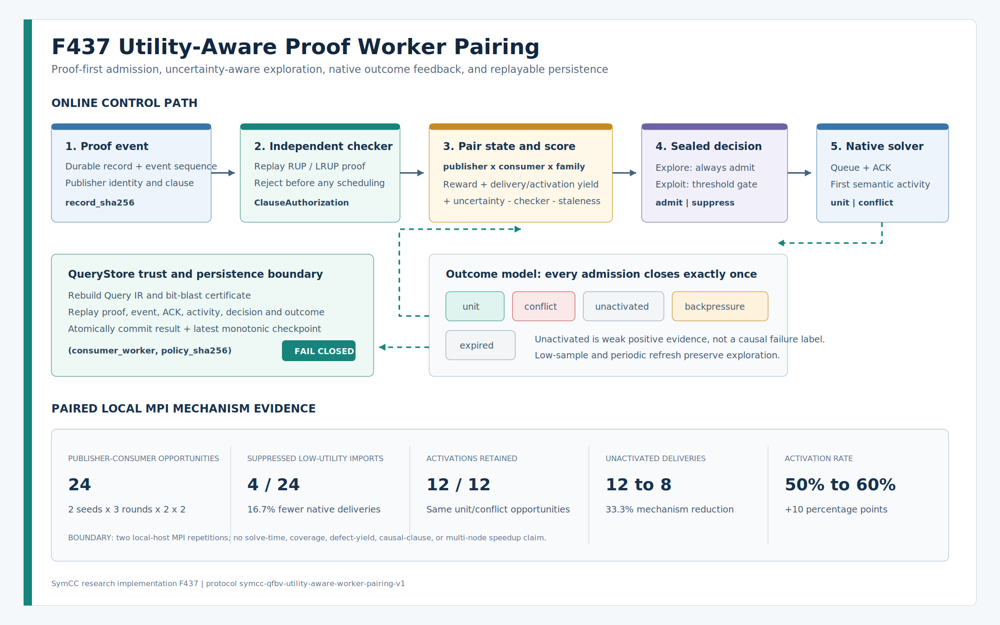

# F437：效用感知的 proof worker pairing

- 功能编号：F437
- 日期：2026-08-18
- 研究主题：checked-clause 的 publisher/consumer 配对、探索与利用、native activity 反馈、可重放决策、持久恢复、paired MPI 机制实验
- 当前等级：I/T/E-local
- 严格边界：已证明本机多 rank 下能够减少已观测低效 pair 的 native 导入并保留本实验中的 activation；尚无公开目标、多节点、coverage、defect-yield 或 solve-time R 级结论



## 1. 为什么 F436 之后仍需要 pairing

F433--F435 已能在求解中交换经过 RUP/LRUP 检查的 clause，并处理 native ACK、背压和重试；F436
进一步区分“交付”与“第一次成为 unit/conflict”。但在 F436 的本机实验中，两个 publisher 对同一
consumer 的结果长期不同：一个 pair 产生 unit activity，另一个 pair 虽然交付成功却未激活。若仍把
所有 checked record 无差别注入每个 solver，会继续消耗：

1. proof record 加载和检查时间；
2. event 扫描、队列和 ACK 空间；
3. native clause attach、watch/propagation 相关工作；
4. 多节点环境中的序列化和网络带宽。

F437 将学习单元定义为：

```text
(publisher_worker, consumer_worker, formula_family_sha256)
```

这比“全局 publisher 质量”更精确：同一 clause 在不同 consumer 的 trail、已有 learned database 和
搜索区域上可能具有不同作用；同时又比按 exact formula SHA 学习更可复用，因为后者每个新 query
都会冷启动。

## 2. 与并行 SAT / 符号执行前沿的关系

| 一手工作 | 关键结论 | F437 的吸收与边界 |
| --- | --- | --- |
| Painless, SAT 2017 | 将 diversification、clause sharing 与 solver 封装为可组合并行框架 | 沿用 source/consumer 分离；本项目没有宣称复现全部 Painless portfolio |
| Parallel Clause Sharing Based on Graph Structure, SAT 2024 | LBD 依赖发送端搜索状态，接收端利用率可能很低 | 不采用发送端 LBD 作为默认 pairing reward；使用 consumer 端 activity |
| Mallob, 2022 | 大规模 clause sharing 与可塑 job 调度需要受控资源和分布式反馈 | F437 完成收益信号与 pair gate；动态 grow/shrink 属于后续 F438 |
| Streamlining Distributed SAT Solver Design, SAT 2025 | 在 MallobSat 消融中，LBD 对分布式分享没有可测意义 | 默认评分不含 LBD；保留 clause/proof checker 与实际 activity 的可验证信号 |
| Real-time Proof Checking, TACAS 2026 | 分布式增量 SAT 可在 clause 使用前实时检查 proof | F433--F437 坚持 proof-first；pairing 永远不能绕过 checker |
| PalRUP, SAT 2026 | 并行持久 proof artifact 可由去中心化小型 checker 组合验证 | F437 的 decision/outcome 引用现有 proof DAG；尚未实现 PalRUP wire 互操作 |

主要来源：

- [Painless](https://www.lrde.epita.fr/dload/papers/le-frioux.17.sat.pdf)
- [Parallel Clause Sharing Strategy Based on Graph Structure](https://drops.dagstuhl.de/entities/document/10.4230/LIPIcs.SAT.2024.17)
- [Mallob](https://arxiv.org/abs/2205.06590)
- [Streamlining Distributed SAT Solver Design](https://drops.dagstuhl.de/entities/document/10.4230/LIPIcs.SAT.2025.27)
- [Real-time Proof Checking for Distributed Incremental SAT Solving](https://satres.kikit.kit.edu/papers/2026-tacas-distrincproof.pdf)
- [A Natively Parallel Proof Framework for Clause-Sharing SAT Solving](https://drops.dagstuhl.de/entities/document/10.4230/LIPIcs.SAT.2026.17)

F437 是基于这些原则完成的项目内系统设计，不应写成上述论文已经提出了相同评分函数。

## 3. Formula family：跨 query 学习但不错误合并

family digest 不包含 query id、formula SHA、assumption SHA 或 CNF SHA；这些字段会使每个具体 query
形成独立 arm。它包含：

- root、IR node、CNF variable、clause、input offset 数量；
- 最大 bit width 和完整 operator histogram；
- bit-blast schema、CNF protocol、bit order；
- activation-guarded 语义。

因此，同一程序结构在不同输入值或不同随机公式实例间可以共享历史；operator 数量、宽度、CNF 编码
协议或 guard 语义变化时必须分族。family 只是调度上下文，不授权 proof 重用；每条具体 record 仍要在
当前 exact formula 上独立检查。

多 rank oracle 使用随机变量关联和随机极性位置，但每轮固定相同的负 literal 总数。这样每轮公式 SHA
不同、family SHA 相同；baseline 和 treatment 又能在同 seed 下得到逐字相同公式。

## 4. 整数确定性的效用评分

每个 pair 保存 `PairFeedback`：decision/explore/exploit、admit/suppress、五类 outcome、累计 reward、
checker 时间、event lag 和最后反馈 ordinal。令：

```text
n = unit + conflict + unactivated + backpressure + expired
d = unit + conflict + unactivated
a = unit + conflict

R = reward_total / max(1, n)
Y_delivery   = 1000 * (d + 1) / (n + 2)
Y_activation = 2000 * (a + 1) / (d + 2)
U = uncertainty_scale / sqrt(n + 1)
P_checker = bounded(mean checker_us / checker_reference_us)
P_lag     = bounded(mean event_lag / event_lag_reference)

score = R + Y_delivery + Y_activation + U - P_checker - P_lag
```

实现只使用有界整数、`isqrt` 和规范 JSON，不使用平台相关浮点数。默认 reward：

| outcome | reward | 解释 |
| --- | ---: | --- |
| `conflict` | 5000 | 接收端第一次形成真实 conflict opportunity |
| `unit` | 4500 | 接收端第一次形成真实 unit opportunity |
| `unactivated` | 500 | 交付成功但本次未观测到 activity；是弱正证据，不是因果负标签 |
| `expired` | -250 | 已准入，但 solve 在 ACK 前结束或 session 终止 |
| `backpressure` | -500 | 已准入但 native queue 未接受 |

默认 `min_score=3250`。当前 checker penalty 包括该 pair 的历史平均和当前 candidate；staleness 使用 durable
event sequence 差，不在主机间相减 monotonic clock。

### 4.1 探索不是可选装饰

低于 `min_exploration_samples=2` 的 pair 无条件进入 explore/admit；达到样本数后才按阈值 exploit。
距离最后 feedback 达到 `refresh_after_events=128` 时重新探索，避免早期噪声永久饿死 pair。一次 decision
至少预留一个 controller event 给 outcome；预算不足时失败关闭，不产生无法结算的 admission。

`unactivated` 可能由重复、更强 clause、提前结束或 trail 尚未进入相关区域造成，不能直接解释为“该
clause 无用”。F437 只学习观测效用，不作单 clause 唯一因果归因。

## 5. 生产执行次序

一次实时 candidate 的严格顺序是：

1. 从 SQLite durable event stream 取得 `(event_sequence, record_sha256)`；
2. 从 proof CAS 加载 record，并在当前 bit-blast plan 上重放 RUP/LRUP；
3. 去除 session 内已见的 exact record 和规范 clause；
4. 计算 family、event lag、checker elapsed 和 publisher/consumer identity；
5. controller 生成带 prior feedback、score components、action 和双 ordinal 的密封 decision；
6. `suppress` 直接结算 candidate，不进入 native queue；
7. `admit` 才进入既有 adaptive admission/native enqueue 路径；
8. ACK 后记录 delivered；第一次 activity 形成 `unit/conflict` receipt；
9. finish 将其他 admission 唯一结算为 `unactivated`、`expired` 或 `backpressure`；
10. verifier 按 controller ordinal 合并 decision/outcome，要求每个 admission 恰好一个 outcome。

这条顺序意味着 **pairing 不能省掉当前 record 的 proof checker CPU**，因为先检查、后决策是可信边界。
本阶段减少的是 native 导入、队列和后续 solver 工作。若未来要在 checker 前过滤，只能增加一个不授权
执行的 cheap prefilter；被选中的 record 仍必须完整检查。

## 6. 密封、重放与持久状态

协议为：

```text
symcc-qfbv-utility-aware-worker-pairing-v1
```

四类 artifact 均使用 exact schema 和规范 JSON SHA-256：

| artifact | 关键绑定 |
| --- | --- |
| policy | 全部阈值、reward、预算和协议 |
| decision | policy、candidate、prior feedback、score components、action、decision/event ordinal |
| outcome | decision、record、pair、reward、event ordinal |
| snapshot | 全 pair 状态、totals、next ordinals、pending count |

verifier 不只重算摘要，还重算 score、pair identity、累计 reward、decision/outcome authorization、连续 ordinal、
delivery/activity 对应和 snapshot suffix。增加字段后重新封印、修改累计 reward 后重新封印、重复 outcome、
跨 stream 或跨 family 重放都会失败。

### 6.1 QueryStore 原子 checkpoint

QueryStore 先从当前 Query IR 重建 bit-blast plan，再加载 proof、event、ACK 和 activity receipt，最后重放
pairing stream。只有独立复核成功的 snapshot 才与 result 在同一 `BEGIN IMMEDIATE` 事务中写入：

```text
utility_pairing_snapshots[
  consumer_worker,
  policy_sha256
] = latest verified snapshot
```

checkpoint 只允许 ordinal 单调前进；同 ordinal 不同 SHA 被视为 fork；旧结果可以完成但不能回滚较新
学习状态。进程重启时 `PersistentCadicalQfbvSolver` 在创建任何 session 前加载并验证 snapshot。损坏 JSON、
摘要、policy、consumer 或 ordinal 会使 backend 启动失败，而不是静默冷启动。solve 完成但 QueryStore
事务未提交时不更新学习状态，避免未复核 worker telemetry 污染 controller。

## 7. 多 rank 实验合同

F434 runner 新增 `--utility-pairing`，并强制：

- 同时启用 `--track-clause-activity`；
- 至少三轮，前两轮形成探索样本，第三轮才能观察 exploit；
- controller 在同一 consumer 的多轮间连续；
- 每轮所有 publisher record 都必须恰好有一个 pairing decision；
- `admit = delivered + expired + backpressure`；
- `opportunities = admit + suppress`；
- delivered outcome 与 ACK/activity 集合完全一致；
- rank 0 独立重放 proof/event/ACK/activity/pairing。

实验用 `active_at_publication` 记录 barrier 释放时所有 consumer 已观测 `solving=1`，而不是在等待 candidate
完成后补采样。是否赶上实际 solve 由 ACK 或 `expired` 独立表达，避免把短求解竞态误报成 active gate 失败。

## 8. 真实 paired CaDiCaL 结果

环境：本机 5 MPI ranks，2 publishers、2 consumers、1 coordinator；CaDiCaL 3.0.1；每个 seed 三轮；
200 variables、860 clauses；baseline 与 treatment 共享 exact formula SHA。执行两个独立 seed：62519、
128056。

| seed | baseline delivery | pairing delivery | suppressed | baseline activation | pairing activation | unactivated：base -> pair |
| ---: | ---: | ---: | ---: | ---: | ---: | ---: |
| 62519 | 12/12 | 10/10 admitted | 2 | 6 | 6 | 6 -> 4 |
| 128056 | 12/12 | 10/10 admitted | 2 | 6 | 6 | 6 -> 4 |
| 合计 | 24 | 20 | 4 | 12 | 12 | 12 -> 8 |

机制结论：

- 低效 native 导入减少 `4/24 = 16.7%`；
- 本实验观测到的 unit/conflict opportunities 保留 `12/12`；
- unactivated delivery 减少 `4/12 = 33.3%`；
- activation rate 从 `12/24 = 50%` 提高到 `12/20 = 60%`，增加 10 个百分点。

两组 consumer solve-time 总和分别为 `7,957,901 -> 8,001,819 us` 和
`7,926,864 -> 7,817,553 us`，方向不一致；合计约 `-0.41%`，样本量、环境和实验目的均不支持性能
推断。checker 总时间也受运行噪声影响，而且 pairing 在 checker 后决策，不能把差值解释为 checker
节省。正确表述仅限“减少 native 导入并保留本机制实验的 activation”。

最终 ablation artifact SHA：
`058c5deeac5684aa0dc2b06f4a6d46fdfcc9d9a0f97346bb210fd794c2cc97d4`。

## 9. 测试和四轮 review

专项覆盖包括：

- family value-insensitive/shape-sensitive 身份与错误字段类型；
- 低样本 explore、阈值 suppress、周期 refresh 和高效 pair exploit；
- 历史 checker/staleness 平均成本；
- decision/outcome/snapshot 增字段重封印、reward 重封印、重复反馈；
- controller event 预算必须为 outcome 预留空间；
- randomized 256-event interleaving与完整 replay；
- realtime fake native、真实 native ACK/activity、adaptive 组合；
- QueryStore proof/event/activity/pairing 二次复核；
- checkpoint 重启恢复、损坏 snapshot 启动前拒绝；
- 三轮多 rank 抑制、聚合守恒、paired formula identity 与篡改；
- 两个真实 seed 的 baseline/treatment MPI oracle。

review 中修复的关键问题：

1. outcome/snapshot 接受合法重封印的额外字段，以及 snapshot 未重算累计 reward；
2. event budget 最后一个 admit 没有空间写 outcome；
3. 评分只惩罚当前 checker/lag，没有保留 pair 历史成本；
4. 多 rank 聚合错误要求 `admit == delivered`，未建模 `expired`；
5. `active_at_publication` 在等待完成后采样，短 solve 会误报；
6. 固定 `+/-/+` 极性虽保持 family，却使 SAT fixture 过易；改为随机位置、固定负号基数；
7. controller 只跨 solve 常驻内存，进程重启丢失学习；现已原子持久化和恢复；
8. 图示使用非标准 SVG 字重导致 CairoSVG 巨大文字渲染，已修复并检查 PNG；
9. 非法 outcome 在枚举验证前移除 pending admission，导致后续无法结算；现改为先验证再改变状态；
10. backend、pairing协议和QueryStore对worker identity边界不一致；现复用同一校验器并按实际consumer恢复；
11. 双LLVM重载下取消测试的1秒helper可在未看到活动标志时仍返回SAT；现延长有界等待并显式断言前置条件。

当前 F437 相关 Python 门禁为 `68 passed + 25 subtests`，Ruff 与 py_compile 通过。完整能力门禁为
`1290 passed + 291 subtests`，node-id身份`1290/1290`精确匹配，零skip、xfail、xpass、deselection和
collection error；规范node-id SHA-256为
`6a9f273eae9ca720fa9eb321775495523d5cef9803f97f7d8220c095b68117ba`。LLVM 17发现327项并通过325项，
另有2项预期unsupported；LLVM 18发现327项并通过326项，另有1项预期unsupported。两套门禁均为零
failure、零unresolved。LLVM 18首次与LLVM 17并行重载运行时暴露一个既有取消测试未建立活动前置条件；
加固等待与显式断言后，隔离用例连续20次通过且完整LLVM 18复跑通过。

## 10. 配置与实现映射

生产 portfolio：

```json
{
  "realtime_stream": {
    "library": "/path/to/libsymcc_qfbv_cadical_realtime.so",
    "track_clause_activity": true,
    "pairing": {
      "min_exploration_samples": 2,
      "refresh_after_events": 128,
      "min_score": 3250,
      "max_pairs": 4096,
      "max_events": 1000000
    }
  }
}
```

| 文件 | 责任 |
| --- | --- |
| `util/qfbv_utility_pairing.py` | family、policy、score、controller、artifact seal/replay、snapshot |
| `util/qfbv_realtime_stream.py` | proof-first decision、native settlement、session evidence |
| `util/cadical_qfbv_backend.py` | persistent worker controller 与启动恢复 |
| `util/query_store.py` | 独立复核、原子 checkpoint、统计 |
| `util/symcc_query_service.py` | 严格配置解析和能力依赖 |
| `util/qfbv_multirank_evaluation.py` | opportunity/admit/delivery/activity/pairing 守恒 |
| `benchmark/run_qfbv_realtime_multirank.py` | 多轮 consumer controller 和 rank-0 replay |
| `benchmark/check_qfbv_utility_pairing_oracles.py` | exact-formula paired baseline/treatment oracle |
| `test/test_qfbv_utility_pairing.py` | 核心状态机、随机交错和篡改负例 |
| `test/test_qfbv_realtime_stream.py` | session、生产 backend、QueryStore 持久恢复 |
| `test/test_qfbv_realtime_multirank.py` | 三轮多 rank 和 paired 聚合合同 |

## 11. 完成边界与后续

F437 已达到 I/T/E-local，可以说“实现了 proof-first、activity-aware、可持久恢复的 worker pairing，
并在两组本机 paired MPI 机制实验中减少 16.7% native 导入且保留全部观测 activation”。不能说：

- 真实程序中一定减少 16.7% clause traffic；
- activation 是单 clause 因果贡献；
- solve time、fuzzing coverage 或 defect yield 已提升；
- 已完成多节点 Mallob 式 malleability 或 PalRUP/ImpCheck 互操作。

直接后续仍是 F438 动态资源伸缩、F439 proof wire 互操作和 8/32/128 worker 公开 R 级实验；更广的
语义/搜索缺口见 F437 后 SOTA 审计。
