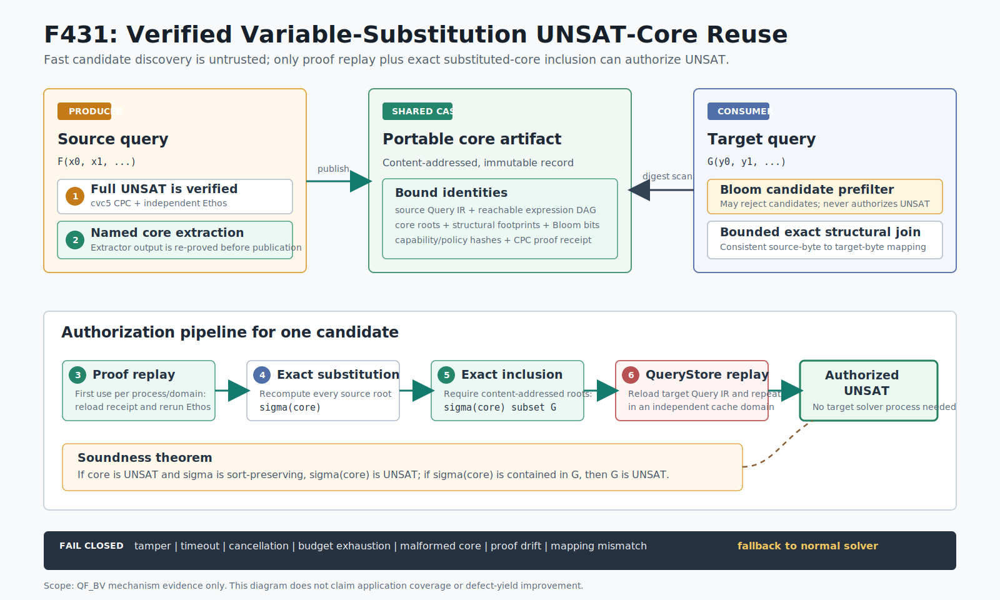

# F431：可验证的 QF_BV 变量置换 UNSAT-core 复用

- 实施日期：2026-08-17
- 功能编号：F431
- 完成等级：I/T/E-mechanism，不是 R 级公开目标结论
- 核心实现：`util/qfbv_substitution_core.py`
- 生产接线：`util/qf_bv_backend.py`、`util/query_store.py`、`util/symcc_query_service.py`
- 权威测试：`test/test_qfbv_substitution_core.py`
- 独立 oracle：`test/qfbv_substitution_core_oracle.py`
- 机制基准：`test/qfbv_substitution_core_benchmark.py`
- 原始证据：`docs/codex/evidence/f431-qfbv-substitution-core-2026-08-17/`



## 1. 研究问题

符号执行会反复产生结构相同、仅输入字节位置不同的 QF_BV 公式。例如，解析器的不同字段、循环
迭代和同构状态可能分别形成：

```text
core(x0)   = (x0 = 0x41) AND (x0 = 0x42)
target(x7) = (x7 = 0x41) AND (x7 = 0x42) AND P
```

传统精确 cache 因 Query IR 摘要不同而失配；prefix cache 也要求祖先关系。F431要回答的是：能否在
不信任近似指纹、不信任core提取器、也不降低现有CPC/Ethos证明门的前提下，发现变量置换
`sigma={x0 -> x7}`，并由源core直接授权目标UNSAT？

困难不在于“把变量名忽略后哈希相等”，而在于同时关闭以下边界：

1. 多个子句对同一源变量给出的映射必须一致；
2. 非单射置换合法，多个源变量可以映射到同一目标变量，源子句也可能塌缩；
3. Bloom filter只能减少候选，不能成为证明；
4. core提取结果必须重新证明，不能继承完整公式的UNSAT权限；
5. worker命中后，QueryStore必须从落盘Query IR独立复核目标公式；
6. 候选扫描、自然连接、证明进程、文件读取和生命周期操作均需有界、可取消并失败关闭。

## 2. 技术来源及迁移边界

主要技术来源是2025年的 *Cache-a-lot: Pushing the Limits of Unsatisfiable Core Reuse in
SMT-Based Program Analysis*。论文用忽略变量名的结构哈希、公式footprint、Bloom预过滤、逐子句
变量对应关系和自然连接搜索更一般的变量置换，并报告其评测中最高74%的core复用率。

- 论文与版本记录：[arXiv 2504.07642](https://arxiv.org/abs/2504.07642)
- 本地检索PDF的SHA-256：
  `4e571b08a6ccbdc1bac82c88ae9e0eba41b995bd424ff4d9186420b9603e6cb2`

F431迁移了论文的核心匹配思想，但没有直接照搬其信任模型：

| 维度 | Cache-a-lot | F431 |
| --- | --- | --- |
| 候选发现 | 结构哈希、footprint、Bloom | 同类机制，但Bloom只作拒绝型预过滤 |
| 置换域 | SMT变量置换 | 当前限定为Query IR中8-bit input `read.attrs.index` |
| 精确检查 | 子句匹配及关系连接 | 内容寻址AST递归统一、域交集、自然连接、最终重算摘要 |
| UNSAT权限 | 缓存core语义 | core单独生成CPC并由Ethos验证；目标端再检查包含关系 |
| 消费提交 | 分析器内复用 | backend和QueryStore两个独立验证域 |
| 分布式生命周期 | 论文原型边界 | SQLite/CAS、配额、stable read、F429依赖图和有界GC |

因此准确表述是“Cache-a-lot式QF_BV输入字节变量置换复用”，不是论文所有SMT sort和公开实验的
完整复现。

## 3. 正确性依据

设源core为子句集合`C`，目标公式为子句集合`G`，`sigma`为保持sort与位宽的变量置换。F431使用
两个简单但必须同时成立的事实：

1. 若`C`为UNSAT，则任意保持符号签名的置换实例`sigma(C)`仍为UNSAT；否则`sigma(C)`的模型可
   沿置换反向给出`C`的模型，与UNSAT矛盾；
2. 若`sigma(C) subseteq G`且`sigma(C)`为UNSAT，则更强的合取`G`也为UNSAT。

生产授权条件因此是：

```text
EthosAccepts(CPC(C))
AND exact_digest_recompute(sigma(C)) subseteq target_root_digests(G)
AND QueryStore repeats both checks for persisted G
```

结构fingerprint、Bloom命中、候选行数、映射启发式以及源完整公式UNSAT都不单独出现在授权谓词中。
非单射映射不会破坏该定理；它只是让多个源符号共享一个目标符号，并可能让两个置换后子句具有同一
摘要。正因如此，review中删除了错误的“源core子句数不得大于目标子句数”候选过滤。

## 4. 生产执行次序

### 4.1 源查询发布

1. backend按原路径求解完整QF_BV公式；只有现有proof verifier已经授权UNSAT才尝试发布；
2. 将每个root命名为`symcc_core_i`，用显式命令调用cvc5提取UNSAT core；
3. 严格解析唯一`unsat`结果和唯一、已知、无重复的名字列表；
4. 从Query IR裁剪core可达表达式图，生成独立core query；
5. 对core本身执行cvc5 CPC生成和Ethos检查，得到绑定toolchain、capability和core内容的receipt；
6. 构造规范记录、计算`record_sha256`，在CAS与SQLite索引中失败原子发布；
7. 发布失败只记录telemetry，不推翻已经由完整公式证明的UNSAT。

### 4.2 目标查询命中

backend的顺序固定为：精确目标proof receipt复用、F431置换core复用、最后才是实际solver。

1. 对目标roots计算忽略且仅忽略`read.attrs.index`的结构footprint与1024-bit/7-hash Bloom；
2. SQLite按受限scan预算返回record摘要，不提前打开无限个CAS对象；
3. Bloom检查core footprint是否可能包含于目标footprint；失败即跳过；
4. stable regular-file读取并规范化record，验证内容摘要、可达图、协议、policy和receipt绑定；
5. 当前进程/验证域首次看到record时重放Ethos；同一不可变record的后续目标可命中有界LRU；
6. 逐源子句与同footprint目标子句递归统一，生成源offset到目标offset的候选行；
7. 对变量域先做交集收缩，再按选择性执行跨子句自然连接；
8. 用得到的完整映射重新计算所有`sigma(core)`内容摘要并要求其集合包含于目标root集合；
9. backend返回候选记录、规范映射、证明/匹配成本，但不伪造目标专属receipt；
10. QueryStore重新加载目标Query IR、重做lowering，使用独立`query-store`验证域重放证明和映射；
11. 只有二次复核一致，结果才提交为UNSAT。

### 4.3 失败路径

以下任一条件都不能产生core命中：JSON重复member、CAS或摘要篡改、symlink、目录身份变化、proof或
capability漂移、未知core名字、重复名字、输出超限、子进程超时、取消、变量映射冲突、join预算
耗尽、总deadline耗尽、目标包含关系失败或QueryStore重算不一致。lookup失败回到正常solver；新core
发布失败保留已经验证的完整UNSAT。

## 5. 实现细节

### 5.1 结构身份与Bloom

`structural_fingerprint()`保留operator、位宽、有序children、常量及所有其他attrs，仅把8-bit
`read`的`index`替换为变量占位符。这样`x0=0x41`与`x7=0x41`同构，而`x0=0x42`、交换非交换
operator的children、不同位宽和不同operation仍不相等。

每个core保存footprint multiset派生信息与固定1024-bit Bloom。Bloom只用于快速证明“不可能包含”；
假阳性进入后续精确流程，不会授权。扫描另有`max_candidate_scan`，避免在SQL `LIMIT`之后才做Bloom
导致前部假阳性饿死后部真实候选。

### 5.2 精确统一与自然连接

`_unify_clause()`按有序AST递归，普通节点必须完全相同；对应位置的read产生`source_offset ->
target_offset`。一个子句内重复源read必须映射一致。各子句候选行构成关系表，跨表以共享源变量为
join key。实现先求每个源变量在所有相关表中的可能目标域交集，再按表选择性进行有界回溯。

映射不要求injective。最终权威不是关系表本身，而是`substituted_root_digests()`在原内容寻址图上
重建每个节点并验证置换后root集合。边界为core最多64 clauses、目标最多4096 clauses、图最多
250000 nodes、深度512，并由`max_unification_pairs`、`max_join_states`和绝对deadline共同限制。

### 5.3 证明复用缓存

已验证core的LRU key为`(verification_domain, record_sha256)`：

- worker域首次使用重放Ethos；发布路径因刚完成proof verifier检查，可只seed worker域；
- QueryStore域首次提交仍独立重放，不能借用worker域状态；
- 同一进程和域内后续目标只复用“源core已被证明UNSAT”这个不可变定理；
- 每个目标仍重新做精确置换与包含检查；
- 新进程缓存为空，必须重新检查receipt。

该设计解释了为什么冷复用可能比直接求解慢，而一个源core服务大量同构目标时才产生摊销收益。

### 5.4 存储、并发和生命周期

`QfbvSubstitutionCoreStore`使用SQLite WAL/FULL和immutable CAS。读取要求预期shard路径、regular file、
`O_NOFOLLOW`和稳定身份；root、shard、index及publication lock的symlink/替换均拒绝。并发发布由稳定
lock inode串行化，同内容只有一个CAS对象。record条数、总字节、单record 128 MiB、扫描数、读取数和
锁等待均有界。

F429生命周期增加`core`artifact kind以及`core -> receipt -> proof`依赖。旧的精确四类metadata
`context,lemma,proof,receipt`可一次性迁移为五类；任意其他不匹配仍失败关闭。GC必须先删core，再让
receipt/proof成为不可达对象，避免留下悬空证明依赖。

### 5.5 证明进程边界

core extractor用一个selector循环同时排空stdout/stderr，在同一绝对deadline下限制stdout为8 MiB、
stderr为64 KiB。超时、取消或输出溢出会终止并回收整个process group；注册协议使用token和event，
避免取消线程误杀已经被复用PID指向的新进程。任何非规范输出只导致“不发布”。

## 6. 配置与可观测性

F431是显式opt-in。一个已有`unsat_proof`的`smtlib-qfbv` portfolio entry可增加：

```json
{
  "substitution_cores": {
    "extractor_command": ["cvc5", "--lang=smt2", "--safe-mode=safe", "{query}"],
    "max_candidates": 64,
    "max_candidate_scan": 4096,
    "max_join_states": 65536,
    "max_unification_pairs": 1000000,
    "verified_core_cache_entries": 1024,
    "lookup_timeout_ms": 5000,
    "publish_timeout_ms": 30000
  }
}
```

共享store由`--qfbv-substitution-core-store`、`--qfbv-substitution-core-max-records`和
`--qfbv-substitution-core-max-bytes`控制，也有对应`SYMCC_QFBV_SUBSTITUTION_CORE_*`环境变量。未显式
给路径时使用`<query-store>/qfbv-substitution-cores`。启用core但未配置F427 proof verifier会在启动时
拒绝，而不是退化为不检查证明。

结果telemetry区分attempt/hit/candidate scan/proof reused/checker time/match time/clause pairs/rows/join
states/publish attempt/created/error；service统计单独报告core store cardinality和bytes。

## 7. 测试与实验结果

### 7.1 正确性与故障测试

定向集合覆盖：alpha-equivalent正例；常量、child顺序和重复read反例；跨子句映射冲突；非单射映射
与子句塌缩；Bloom假阳性；全变量映射；CAS/proof/mapping篡改；join/总deadline；4096-root边界；
真实cvc5 producer与fresh consumer；worker/QueryStore独立缓存域；persistent solver在不存在主solver
命令时由core命中；并发发布、配额、lock timeout、symlink、GC迁移；extractor超时、双pipe输出限制、
取消和进程回收。

重新封存结果：

| 门禁 | 结果 |
| --- | --- |
| F431 + lifecycle定向Python | 38 passed |
| QF_BV proof/context/store相关Python | 101 passed + 45 subtests passed |
| 完整capability-closed Python | 1221 passed + 278 subtests passed；0 skip/xfail/xpass/deselect/missing/unexpected |
| LLVM 17完整lit | 315 passed + 2既有unsupported / 317 |
| LLVM 18完整lit | 316 passed + 1既有unsupported / 317 |
| Python debug allocator/dev mode | 38 passed，warnings-as-errors |

F431没有新增C/C++执行路径，因此不把F430的ASan/UBSan结果冒充本功能sanitizer证据；新增Python路径由
`PYTHONMALLOC=debug`、`PYTHONDEVMODE=1`和`-W error`覆盖。

### 7.2 独立有限域oracle

oracle不调用生产自然连接算法决定期望值，而是枚举每个源变量到目标offset域的全部函数，独立重算
置换后root摘要并比较包含关系。固定seed `0xF431=62513`的两次512-case运行语义完全一致：

| cases | positive | negative | non-injective positive | mismatch |
| ---: | ---: | ---: | ---: | ---: |
| 512 | 294 | 218 | 97 | 0 |
| 512 | 294 | 218 | 97 | 0 |

### 7.3 冷/热机制基准

工具固定为cvc5 1.3.4与Ethos 0.0.9。baseline对每个目标重新生成CPC并运行Ethos；cold reuse由fresh
consumer首次重放源proof再做匹配；warm reuse在同一验证域命中已验证源core缓存，但仍逐目标重做
精确置换。每组64轮：

| 目标公式 | baseline median / p95 / total | cold reuse | warm median / p95 / total | total ratio |
| --- | --- | ---: | --- | ---: |
| 2 clauses | 102011 / 109551 / 6595236 us | 119787 us | 7432 / 8166 / 475796 us | 13.861x |
| 130 clauses | 102306 / 123663 / 6713512 us | 134715 us | 17150 / 19606 / 1124011 us | 5.973x |

冷复用在这两个微型UNSAT问题上比baseline中位数更慢；热结果证明的是跨同构目标摊销机制，不是单次
core replay天然更快。实验没有运行fuzzer、没有测覆盖率或错误发现，不能外推为应用级speedup。

## 8. 多轮review记录

### Review 1：语义与错误授权

1. 删除“source clause count <= target clause count”过滤，因为非单射置换可让多个source roots塌缩；
2. 结构hash仅忽略read index，保留常量、位宽、operator和child顺序；
3. Bloom明确降为候选拒绝器；最终必须重算内容摘要；
4. 增加变量domain intersection及独立穷举oracle；
5. QueryStore不接受backend提供的mapping，必须从落盘Query IR重建并要求精确一致。

### Review 2：并发、资源与故障

1. 修复selector重构时不可达的SIGKILL路径，并验证timeout/cancel后无残留进程；
2. 修复`TimeoutError`被`OSError`包装导致错误分类丢失；
3. deadline扩大到图规范化、fingerprint、substitution和join全流程；
4. 修复SQL `LIMIT`先于Bloom造成的候选饥饿，新增独立scan上限；
5. 增加duplicate-key JSON、stable regular-file、expected shard、root/lock symlink及配额测试；
6. 校验publication lock稳定inode身份，避免锁文件替换造成双写者。

### Review 3：证明缓存与声明边界

1. 将已验证core cache按worker/query-store域拆分，防止worker首次验证替代提交端独立复核；
2. publication只seed worker域；新进程和QueryStore首次使用仍运行Ethos；
3. benchmark同时报告冷负结果与热正结果，不用热缓存数字代表fresh-worker成本；
4. 完整门禁、双LLVM发现集合和source contract进入哈希manifest；
5. 明确F431是QF_BV input-byte支持域和机制证据，不宣称论文74%复用率或fuzzing收益已复现。

## 9. 创新性与挑战性

F431的工程创新不只是新增一种cache key，而是把近似候选发现嵌入现有proof-carrying分布式链：

1. 将变量置换复用从单进程优化提升为内容寻址、可生命周期管理的跨worker定理制品；
2. 用“源core证明一次、每目标精确实例检查”的两级结构摊销昂贵proof replay；
3. 允许非单射映射并以最终内容摘要闭合，支持传统alpha-renaming之外的子句塌缩；
4. 以worker和QueryStore独立cache domain保持二次裁决，同时避免同一提交端重复运行Ethos；
5. 把candidate scan、AST统一、自然连接、proof进程、CAS和GC放入同一有界失败关闭系统。

主要挑战是性能过滤与证明权限必须严格分离：任何为了速度而提前接受结构hash、partial mapping或
cached backend字段，都会把概率结构相似误升格为逻辑蕴含。

## 10. 严格边界与下一顺序

F431尚不包括：

1. 8-bit input read之外的任意SMT sort/array/function变量置换；
2. SAT model在变量置换下的安全复用；
3. 跨solver版本或policy迁移proof/cache状态；
4. 分布式实时learned-clause proof stream和assumption/increment scope；
5. LAVA-M、FuzzBench或多节点等CPU确认性实验。

下一优先项是F432：把CaDiCaL 3.0式bit-blasted QF_BV增量能力、TACAS 2026 LIDRUP/ImpCheck式
assumption/increment scoped实时检查，以及PalRUP式持久并行proof artifact组合到现有F426--F431
身份和生命周期链。该项必须继续保持SAT model由Query IR concrete replay复核、UNSAT由独立proof
checker授权，不能因clause来自“可信worker”而省略证明。

## 11. 复现命令

```bash
PYTEST_DISABLE_PLUGIN_AUTOLOAD=1 python3 -m pytest -q -p no:cacheprovider -W error \
  test/test_qfbv_substitution_core.py test/test_qfbv_artifact_lifecycle.py

python3 test/qfbv_substitution_core_oracle.py --cases 512
python3 test/qfbv_substitution_core_benchmark.py --rounds 64 --padding 0
python3 test/qfbv_substitution_core_benchmark.py --rounds 64 --padding 128

python3 util/python_test_gate.py \
  --min-collected 1221 --max-skips 0 --max-xfails 0 --max-xpasses 0 \
  --max-deselected 0 --max-missing-nodeids 0 --max-unexpected-nodeids 0 \
  --require-nodeid-manifest test/pytest-nodeids.json

lit -q build-llvm17/test
lit -q build/test
python3 docs/codex/verify_delivery.py
```

原始输出、环境、源码摘要、review记录、图和完整非self SHA-256 manifest均保存在同名evidence目录。
