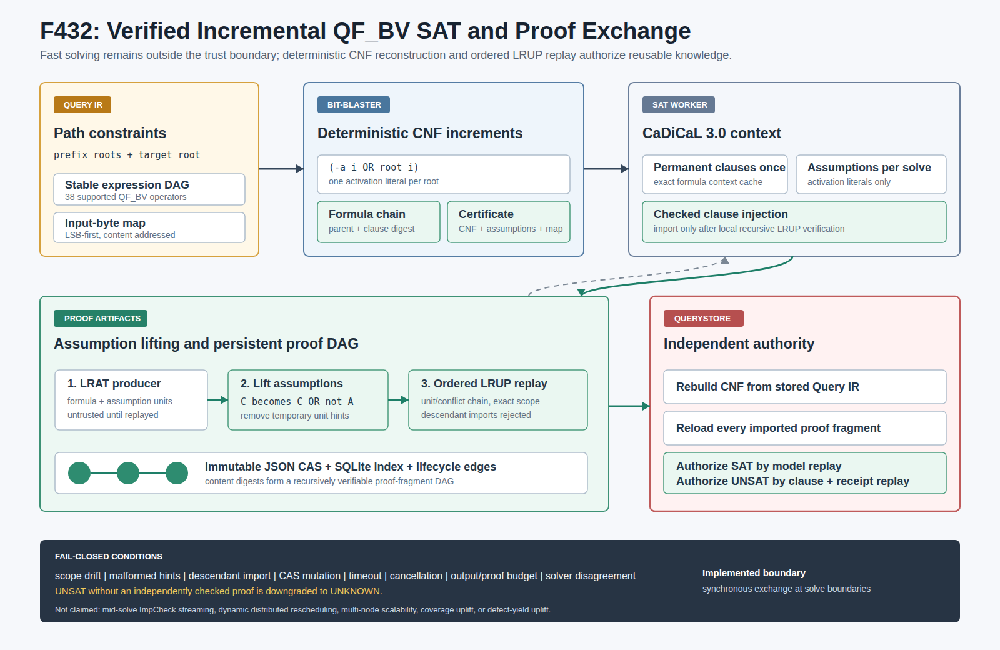

# F432：可验证的增量 QF_BV SAT 上下文与持久证明 DAG

- 功能编号：F432
- 日期：2026-08-17
- 研究主题：assumption/increment scoped SAT、bit-blasting、可验证子句交换、持久并行证明制品
- 实现状态：F432 机制实现与本机验证完成；求解中实时流已由 2026-08-18 的 F433 后续功能补齐，公开多节点评测仍不在本功能声明内
- 证据等级：I/T/E-mechanism，不是 fuzzing coverage、缺陷发现率或多节点扩展性结论



## 1. 结论先行

F432 将 F426--F431 的 SMT 层公式、证明和缓存复用继续下沉到 bit-blasted SAT 层。当前系统已经具备：

1. 将稳定 Query IR 的全部 38 种现有 QF_BV 运算确定性编码为 CNF；
2. 为每个路径约束根分配 activation literal，以 assumption 选择本次求解范围；
3. 通过 CaDiCaL 3.0 C/IPASIR 接口在同一进程中保留精确公式上下文；
4. 将 `formula + assumption units` 的 ASCII LRAT 反证提升为永久公式上的 assumption-guarded LRUP 子句；
5. 在消费端逐步重放 LRUP，只有通过检查的子句才可注入原生 solver context；
6. 将证明片段按 SHA-256 内容寻址，导入边形成可递归复核的持久 proof DAG；
7. 由 QueryStore 重新加载 Query IR、重做 bit-blasting、重载全部证明片段并二次裁决 SAT/UNSAT；
8. 将 proof fragment 纳入 F429 生命周期引用图、租约保护和有界依赖序 GC。

两轮固定 seed 的 512-case 差分 oracle 均为 **0 mismatch**；CaDiCaL 与 cvc5 在 38 运算符矩阵上得到相同输入模型。两轮 64 次本机机制实验中，持久原生上下文相对每次新建 CaDiCaL 子进程的总耗时比分别为 **1.755x** 和 **1.765x**。这些数值只证明固定公式的同进程复用机制有效，不代表真实 fuzzing 覆盖率或缺陷发现速度提升。

## 2. 研究依据与迁移边界

### 2.1 直接依据

| 来源 | 论文或工具的核心能力 | F432 的迁移 |
|---|---|---|
| Schreiber 等，TACAS 2026，*Real-time Proof Checking for Distributed Incremental SAT Solving* | 公式增量、assumption、failed assumptions、实时检查导入子句和增量 UNSAT 结果 | 使用 formula/assumption 独立摘要；所有导入在求解边界同步检查；UNSAT receipt 绑定 failed assumptions |
| Götz、Dörr、Schreiber，SAT 2026，*A Natively Parallel Proof Framework for Clause-Sharing SAT Solving* | PalRUP 以并行文件和小型顺序可信核构造可持久、可并行检查的证明 | 使用独立 JSON proof fragment、内容寻址 import edge 和小型 ordered-LRUP checker 构成持久 DAG |
| Pollitt 等，SAT 2026，*CaDiCaL 3.0* | 完整增量 SAT、assumption、implied/failed 信息和线性 proof hints | 固定 CaDiCaL 3.0.1；使用原生增量上下文及独立 CLI LRAT 生产路径 |
| Mallob/MallobSat | 分布式 clause sharing、增量任务、proof checking、可塑性资源调度 | 本阶段只迁移 proof-carrying clause exchange 的局部机制；没有声称实现 Mallob 的动态资源调度或 3072 核实验 |

权威入口：

- TACAS 2026：https://doi.org/10.1007/978-3-032-22752-2_18
- PalRUP：https://doi.org/10.4230/LIPIcs.SAT.2026.17
- CaDiCaL 3.0：https://doi.org/10.4230/LIPIcs.SAT.2026.40
- Mallob：https://github.com/domschrei/mallob
- ImpCheck 增量实现：https://github.com/domschrei/impcheck/tree/incremental

### 2.2 必须明确的差异

在 F432 完成时，它**不是** ImpCheck/LIDRUP 的逐子句、求解中实时 pipe：worker 在一个 solve 开始前查询共享 CAS，递归复核候选片段，然后把通过的子句加入精确公式的本地 CaDiCaL context。这个历史边界现由 F433 的 CaDiCaL IPASIR-UP checked-import stream 补齐；F432 默认路径本身仍保持 solve-boundary 语义。

F432 的 proof fragment 借鉴 PalRUP 的“并行持久制品 + 小型顺序检查核”思想，但不是 PalRUP 文件格式的逐字实现。项目的片段 schema 为 `symcc-qfbv-palrup-proof-fragment-v1`，子句协议为 `symcc-qfbv-incremental-lrup-clause-v1`；载荷是规范 JSON、SHA-256 内容地址和显式 import edge，可信检查规则是 ordered LRUP。

因此，F432 的准确边界是：**求解边界同步检查、跨任务持久复用、递归 proof DAG**。F433 的实现和证据见 `Realtime_Checked_QFBV_Proof_Stream_F433_2026-08-18.md`；其余 SOTA 缺口列在第 14 节。

## 3. 完整执行次序

一次 `bitblast-cadical-qfbv` 任务按以下顺序执行：

1. QueryStore 根据 lease 加载 roots、expression DAG、原始输入和 capability contract。
2. `bitblast_qfbv_query()` 从 roots 可达图确定性生成 Tseitin CNF。
3. 每处理一个 root，生成新的 activation literal `a_i` 和守卫子句 `(-a_i OR root_i)`。
4. 计算每个 increment 的 parent formula、clause、变量域和 formula SHA-256；另计算完整 assumption、CNF 和 input-map 摘要。
5. 按当前公式及其祖先 increment 摘要查询 proof CAS；每个候选都在本 worker 递归重放。
6. 拒绝摘要漂移、变量域漂移、CNF prefix 漂移、循环 import、descendant-to-ancestor import 和任何非 unit/conflict LRUP hint。
7. 一次性模式写入 `CNF + verified imports + assumption units` 并启动 CaDiCaL CLI；持久模式在原生 context 中只添加尚未加入的 verified imports，再通过 `ccadical_assume()` 设置 activation literals。
8. SAT：只读取 input-byte 对应变量，重建输入字节，并通过 QueryStore Query IR evaluator 重放候选。
9. UNSAT：原生返回 20 仍不构成授权；系统另外启动 proof-producing CLI，读取 ASCII LRAT，并做 assumption lifting。
10. 本地 checker 重放提升后的 proof fragment；通过后原子发布到 proof CAS，并生成绑定 formula、assumption、failed assumptions 和 final clause digest 的 result receipt。
11. QueryStore 收到结果后重新执行第 1--6 步，重新加载 final fragment 及全部 imports，并复核 result receipt。
12. 只有 SAT model replay 或 UNSAT proof replay 成功，结果才进入完成态；否则降级为 `unknown` 或 `error`。

这一设计使“solver 说 UNSAT”“worker 声称检查过”“CAS 中有同名对象”都不能单独成为正确性依据。

## 4. 确定性 QF_BV bit-blasting

### 4.1 支持域

编码器覆盖当前 Query IR 的 38 个 operator：

- 常量与输入：`bool`、`constant`、`read`；
- 位宽结构：`concat`、`extract`、`zext`、`sext`；
- 算术：`add`、`sub`、`mul`、`udiv`、`urem`、`sdiv`、`srem`、`neg`；
- 位运算：`not`、`and`、`or`、`xor`；
- 移位与旋转：`shl`、`lshr`、`ashr`、`rol`、`ror`；
- 关系：`equal`、`distinct`、无符号和有符号八种大小比较；
- 逻辑与控制：`land`、`lor`、`lnot`、`ite`。

每个位向量按 LSB-first 表示。加减使用 ripple carry；乘法使用截断 shift-add；无符号除法/余数使用 restoring division；有符号除法在绝对值域求解后恢复符号；移位使用 barrel stages；任意位宽旋转先对位宽求模。编码保持 SMT-LIB 的除零语义，并覆盖 `min_signed / -1` 溢出边界。

### 4.2 Increment 与 assumption

永久公式不直接断言 root，而是增加：

```text
(-a_i OR root_i)
```

本次路径求解把所有活动 `a_i` 作为 assumptions。这样永久 CNF 可留在 solver 中，路径选择不需要撤销子句。每个 increment 记录：

```text
ordinal, root_hash, activation_literal,
first_clause_id, last_clause_id, max_variable,
parent_formula_sha256, clause_sha256, formula_sha256
```

`max_variable` 是证明作用域的一部分。没有这一字段，较早 increment 的证明可能引用后来才创建的变量，导致“公式摘要看似匹配、变量域实际越界”。F432 的 checker 要求 record 的变量上界与目标 increment 完全相等。

### 4.3 Certificate

`symcc-qfbv-bitblast-cnf-v1` 同时绑定 formula、assumption、完整 CNF、input map、root/node/variable/clause 数、最大位宽和 operator counts。QueryStore 不信任 worker 传回的 certificate，而是从持久 Query IR 独立重算并要求逐字段相等。

## 5. LRAT assumption lifting

CaDiCaL 生成的是下式的 LRAT 反证：

```text
F AND a_1 AND ... AND a_n
```

其中 `F` 是永久 activation-guarded CNF，`a_i` 在 DIMACS 中临时追加为 unit clauses。共享 CAS 不能把这些临时 unit 当作永久事实，因此需要把每个 LRAT 导出子句 `C` 提升为：

```text
C OR (-a_1) OR ... OR (-a_n)
```

检查提升子句时，checker 假设其否定，因而所有 `a_i` 已经为真；原 proof 中对临时 assumption-unit 的 hints 可以删除，剩余 hint 链仍应在永久 `F` 上产生 unit propagation 或 conflict。最后空子句被提升为：

```text
(-a_1 OR ... OR -a_n)
```

这正是“这些 assumptions 不可同时成立”的永久可交换子句。F432 使用全部活动 assumptions 作为合法 failed set；这比最小 failed core 更长，但保持正确。原生 `ccadical_failed` 最小化尚未用来缩短 proof receipt。

RAT hint block、错误删除、未终止字段、重复 clause ID、越界 literal、非 unit hint 或 conflict 后继续使用 hint 均失败关闭。当前交换契约只接受可按 LRUP 检查的片段。

## 6. 持久 proof DAG

每个 `symcc-qfbv-incremental-clause-record-v1` 包含：

- 精确 formula/CNF prefix/变量域；
- producer worker、epoch 和 sequence；
- dependency assumptions；
- import record digest、本地 clause ID 和预期 clause；
- ordered LRUP proof steps；
- 最终可共享 clause；
- 全记录 SHA-256。

导入不是“相信另一个 worker 已验证”，而是加载被引用记录并递归执行同一 checker。检查栈拒绝环；被导入片段的 formula ordinal 必须小于等于消费者 ordinal，因此 descendant 证明不能反向授权 ancestor formula。

存储层使用 immutable JSON CAS、SQLite WAL/FULL 索引、规范 JSON 和 duplicate-key 拒绝。对象读写删除以目录描述符为锚，使用 `O_NOFOLLOW` 及 `openat/linkat/unlinkat` 等价操作，避免分片目录或叶文件被替换后静默越界。发布前后均核对内容，数据库只记录规范相对路径、大小和摘要。

F429 lifecycle 新增 `sat-proof` kind；proof import 转换为生命周期 edge。GC 按依赖顺序先删除引用者、再删除被引用者，active lease、root 和 grace period 继续生效。旧的四类和五类 metadata 集合可迁移到新的六类集合。

## 7. CaDiCaL 后端

### 7.1 一次性 proof-producing 路径

`CadicalQfbvSolver` 强制命令包含 `{cnf}`、`{proof}`、`--plain`、`--lrat` 和 `--no-binary`。stdout/stderr 写入临时文件，退出后按字节合同受限读取并严格 UTF-8 解码；SAT/UNSAT 文本必须分别与退出码 10/20 一致。这避免了无界内存 pipe，但不声称对子进程写盘量实时强制硬上限。LRAT 以 `O_NOFOLLOW` 稳定读取并受 64 MiB 接受上限约束。

进程使用独立 process group；timeout 或 portfolio cancellation 先 TERM，超出 grace 后 KILL，并回收进程。unsupported lowering 返回普通 `unknown`，不会伪造缺字段的 typed result。

### 7.2 原生持久路径

`PersistentCadicalQfbvSolver` 通过 CaDiCaL 3.0 C API 建立 1--64 个 exact-formula LRU contexts：

- 永久 CNF 只添加一次；
- assumptions 每次 solve 重新设置；
- 已验证 import record 每个 context 只添加一次；
- 模型只查询 input literals，不扫描全部 Tseitin 变量；
- terminator callback 和 `ccadical_terminate` 支持 deadline/cancellation；
- 独立 solve lock 防止同一非线程安全 solver 指针并发进入；
- `close()` 也取得 solve lock，不能在活动求解中释放指针。

原生 SAT 仍需 Query IR model replay。原生 UNSAT 永远触发独立 CLI LRAT 路径；即使原生 solver 返回 20，只要 proof 生产、提升、重放、CAS 发布或 receipt 复核任一步失败，最终结果就是 `unknown`。

当前 context cache 是 **exact formula identity**，不是在同一原生指针中从 parent increment 分叉。F426 提供跨 worker formula-plan/prefix transport，F430 提供 Z3 COW parent state；不要把它们误写成 F432 已实现的 CaDiCaL prefix fork。

## 8. QueryStore 二次裁决与可观测性

QueryStore 为每个 proof policy 注册本地 checker。`complete()` 对 F432 结果执行：

1. 重载 Query IR 并重算完整 bit-blast plan；
2. 比较 certificate；
3. 逐个重载和复核 worker 声称导入的 record；
4. 对 UNSAT 重载 final record，并要求它的 imports 与 telemetry 精确一致；
5. 递归重放 proof fragment；
6. 复核 receipt 的 formula、assumption、failed set 和 final clause digest。

新增聚合指标包括 F432 result 数、verified UNSAT 数、新建 fragment 数、import candidates/accepted clauses、store-side checker 时间、native context result 数和 cache hit 数。它们可用于后续消融实验，但不应被直接解释为 coverage。

## 9. 配置与安装

使用固定 installer：

```bash
bash benchmark/install_cadical_3_0_1.sh
```

脚本固定 CaDiCaL 3.0.1 commit `c60730422e758ef1cebe7aeddf2dda31c996bf04`，构建 CLI、dynamic CLI 和 `libcadical.so`，验证 `ccadical_solve`/`ccadical_failed` 导出并输出 SHA-256。

持久 portfolio 示例：

```json
[
  {
    "name": "cadical-3.0.1-native",
    "kind": "bitblast-cadical-qfbv",
    "persistent": true,
    "native_library": "/path/to/libcadical.so",
    "command": [
      "/path/to/cadical", "--plain", "--lrat", "--no-binary",
      "{cnf}", "{proof}"
    ],
    "capabilities": {"incremental": true},
    "max_imported_clauses": 64,
    "context_cache": 8,
    "worker_epoch": 0
  }
]
```

共享 proof store 由 `--qfbv-incremental-proof-store` 或 `SYMCC_QFBV_INCREMENTAL_PROOF_STORE` 配置；记录数和字节配额分别使用 `--qfbv-incremental-proof-max-records`、`--qfbv-incremental-proof-max-bytes` 及同名 `SYMCC_` 环境变量。

该 kind 必须显式声明 `incremental:true`。同一 portfolio entry 不允许混入 SMT CPC proof、learned lemma、substitution core 或 Z3 native-state-fork 配置；这些是不同 backend 的信任与状态模型。

## 10. 测试与独立 oracle

### 10.1 定向与全量门禁

| 门禁 | 结果 |
|---|---:|
| F432 + lifecycle 定向 Python | 38 passed + 13 passed subtests |
| F426--F432 关联 Python | 116 passed + 58 passed subtests |
| 完整 Python identity/capability gate | 1236 passed + 291 passed subtests |
| 规范 node ID | 1236/1236，0 missing，0 unexpected |
| LLVM 17 lit | 320 discovered，0 failure/unresolved |
| LLVM 18 lit | 320 discovered，0 failure/unresolved |

定向测试覆盖：确定性 identity、算术/除零/有符号溢出/超宽移位/非二次幂旋转、错误期望值、严格 DIMACS model、循环图和资源上限、LRUP hint、receipt、真实 ASCII LRAT lifting、递归 import、descendant import、作用域/变量域/protocol tamper、proof DAG 生命周期、分片目录替换、QueryStore 二次授权、status/exit-code disagreement、fake IPASIR context reuse、CaDiCaL signature 和 portfolio capability contract。

### 10.2 512-case 双 oracle

固定 seed `0xF432 = 62514`，23 类复杂二元运算轮转生成 512 个用例。每个用例固定两输入字节，独立计算期望值，交给真实 CaDiCaL 求解；错误 bit-blast 会表现为 UNSAT、错误模型或输入恢复不一致。

| 指标 | Run 1 | Run 2 |
|---|---:|---:|
| cases | 512 | 512 |
| mismatch | 0 | 0 |
| 38-operator matrix | CaDiCaL/cvc5 SAT，同为 `{0:66,1:3}` | 相同 |
| 实际 LRAT proof | 24 steps / 22 propagations | 相同 |
| elapsed | 1,701,925 us | 1,686,276 us |

CaDiCaL 二进制 SHA-256 为 `c2377de6ce6310cc5fd85fc5a5a86679eda6dbb4eb4a3ff960d8aa9fa1be7bae`；cvc5 1.1.2 二进制 SHA-256 为 `f2f4cc5eea252833c4645072c3de46f2c3d4d56f3107f099383516ee885cee10`。

真实 backend smoke 还分别运行了一次 CLI 和原生 shared library 路径：两者均返回 UNSAT、QueryStore 完成成功、proof verified；原生签名为 `cadical-3.0.1-c607304`。

## 11. 性能实验

公式为包含全部 38 个 operator 的 SAT matrix。cold baseline 每轮新建 CaDiCaL 子进程；native warm 保留同一精确公式 context。每轮仍做输入模型恢复和 Query IR validation。

| 指标 | Run 1 | Run 2 |
|---|---:|---:|
| rounds | 64 | 64 |
| cold median | 27,582 us | 27,663 us |
| native warm median | 15,861 us | 15,760 us |
| median ratio | 1.739x | 1.755x |
| cold total | 1,811,539 us | 1,815,886 us |
| native warm total | 1,032,105 us | 1,028,909 us |
| total ratio | 1.755x | 1.765x |

这里的 ratio 是 `cold / native`。它主要反映避免重复进程启动、CNF 解析和 solver 初始化的收益。公式很小，proof import、跨节点 I/O、网络和动态调度没有进入该实验。

## 12. 多轮 review 修复

1. 为每个 increment 增加精确 `max_variable`，阻止证明跨变量域漂移。
2. 原生模型只查询 input variables，避免按全部 Tseitin 变量扫描。
3. 将 native state lock 与 solve lock 分离，使 cancellation 能在 solve 期间进入。
4. `close()` 获取 solve lock，避免活动指针被并发释放。
5. unsupported lowering 返回普通 unknown，避免构造不完整 typed result。
6. proof store 改为目录描述符锚定读写删除，父分片 symlink 替换失败关闭。
7. receipt checker 显式校验 protocol，而不是只依赖最终 digest。
8. proof import 强制 ancestor-or-same ordinal，拒绝 descendant-to-ancestor 依赖。
9. stdout/stderr 从内存 pipe 改为临时文件，严格检查编码和上限；LRAT 采用 nofollow 稳定读取。
10. SAT/UNSAT 文本与 CaDiCaL 10/20 退出码必须一致。
11. 生命周期同步在 store lock 外进入 registry operation，避免 collector/publisher 锁序反转。
12. 新实验脚本加入 lit `RUN --help` 契约，消除测试发现中的 unresolved 项。

## 13. 创新性与挑战性

F432 的创新不在“调用一个 SAT solver”，而在把符号执行的结构身份、增量 SAT 状态和可持久证明合成一条失败关闭的跨 worker 链：

- 同一个 Query IR 同时产生可执行 CNF、increment chain 和可复算 certificate；
- assumption lifting 将一次求解的临时事实转换为永久可交换子句；
- fast native context 与 small trusted checker 分离，求解性能不成为信任依据；
- proof fragment import 与 F429 生命周期 edge 共用同一个持久依赖模型；
- worker 检查用于避免污染本地 solver，QueryStore 检查用于最终授权，两者具有不同 cache domain。

主要挑战是作用域而不是 SAT API：formula prefix、变量域、assumption set、import direction、proof clause ID、solver state 和持久 artifact 必须同时一致。任何一个边界过宽都会把“对另一个增量成立的子句”误注入当前求解。

## 14. 尚未实现的 SOTA 工作

F432 完成后的缺口及截至 2026-08-18 的状态如下：

1. **已完成（F433）：ImpCheck/LIDRUP 式求解中实时流式检查。** 已实现 learner、proof-event stream、动态 checked-import ACK 和 CaDiCaL external-clause callback；尚未实现的是 ImpCheck 原生 wire adapter 和 proof-aware scheduler rescheduling。
2. **P0：公开多节点 R 级评测。** 尚未在 8/32/128 节点上报告吞吐、proof-check overhead、网络/文件系统放大和 coverage/bug yield。
3. **P1：Mallob 式 malleable resource scheduling。** 当前没有按任务优先级动态增减 SAT workers、迁移 clause-sharing topology 或容错重调度。
4. **P1：failed-assumption 最小化。** 当前 full active set 正确但不紧凑，未利用 CaDiCaL 3.0 的 implied/failed API生成更短 receipt。
5. **P1：CaDiCaL prefix-native fork。** 当前只缓存 exact formula context，没有 parent increment 原生分叉或跨进程可移植 CDCL search state。
6. **P2：跨版本/跨 backend proof-state 协商。** 尚无对 clause quality、inprocessing epoch、proof format 和 ABI 的能力协商。
7. **P2：形式化/验证 checker。** ordered-LRUP core 当前由测试和差分 oracle 验证，尚未移植到 CakeML/Isabelle 等形式化可信核。

因此，“还有没有未实现的 SOTA 技术”的严谨回答仍然是 **有**。F432 关闭 bit-blasted、proof-carrying、solve-boundary clause exchange，F433 关闭 project-native mid-solve checked exchange；两者都不等于公开多节点实时分布式 SAT 平台、论文原生 wire 互操作和形式化 checker 已完成。

## 15. 证据位置

原始数据、环境、review、图、门禁和 SHA-256 manifest 位于：

```text
docs/codex/evidence/f432-qfbv-incremental-sat-2026-08-17/
```

可执行入口：

```bash
python3 test/qfbv_incremental_sat_oracle.py \
  --cadical /path/to/cadical --cvc5 /usr/bin/cvc5 --cases 512

python3 test/qfbv_incremental_sat_benchmark.py \
  --cadical /path/to/cadical --library /path/to/libcadical.so --rounds 64
```
