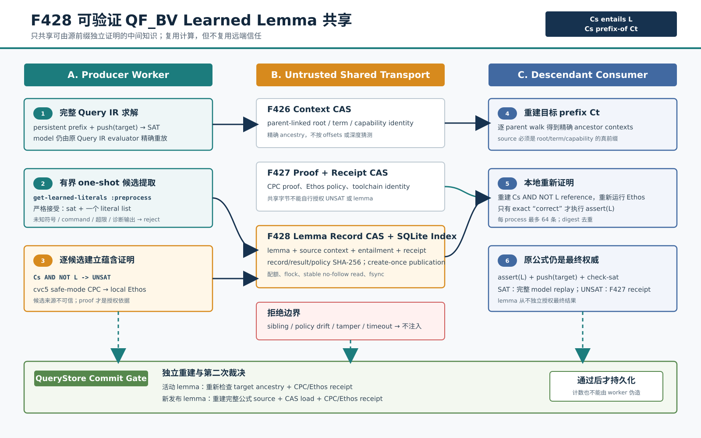

# F428：可验证 QF_BV Learned Lemma 跨 Worker 共享

- 日期：2026-08-17
- 状态：I/T/E-mechanism；W4 第三阶段完成
- 支持域：cvc5 1.3.4、QF_BV、规范 Query IR、F426 内容寻址 prefix context、F427 CPC/Ethos
- 生产入口：`symcc_query_service.py` 的 persistent `smtlib-qfbv` portfolio backend
- 权威测试：`test/test_qfbv_lemma_exchange.py`
- 独立 oracle：`benchmark/check_qfbv_lemma_exchange_oracles.py`
- 原始证据：`docs/codex/evidence/f428-qfbv-verified-lemma-exchange-2026-08-17/`



## 1. 研究问题

F426 允许另一 worker 重建相同的 QF_BV prefix 公式，F427 允许另一 worker 独立检查完整
UNSAT 结果，但二者都没有共享求解过程中得到的中间知识。直接传输 solver 内部 clause database
存在三个不能忽略的问题：

1. 内部 clause 可能依赖预处理变量、assumption、proof scope 或 solver 版本，不能直接解释为原公式结论；
2. 一个在 sibling path 上成立的条件，在当前 prefix 上未必成立；
3. 共享存储与远端 worker 不是信任根，单纯的摘要只能证明字节没变，不能证明 lemma 正确。

F428 选择更保守但可验证的协议：共享的是 cvc5 输出的**布尔 learned literal**，每条 literal 必须
携带其源 prefix，并通过下面的独立蕴含证明：

\[
C_s \models L
\quad\Longleftrightarrow\quad
C_s \land \lnot L\;\text{为 UNSAT}.
\]

消费者只在 `C_s` 是目标 prefix `C_t` 的精确祖先时使用它：

\[
C_t = C_s \land \Delta \;\Longrightarrow\; C_t \models L.
\]

因此传输层即使返回错误 literal、错误 source context 或被篡改 proof，也不能授权一次注入。

## 2. 技术来源与迁移边界

cvc5 官方接口把 learned literals 定义为当前 assertions 所蕴含的 literals，并通过
`produce-learned-literals` 与 `(get-learned-literals :type)` 暴露 `preprocess`、`input`、
`solvable` 和 `internal` 类别。官方说明中 `input` 或 `preprocess` 通常最接近输入公式，但 F428
不信任类别标签本身，而是重新证明每个候选。来源：

- [cvc5 output tags: get-learned-literals](https://cvc5.github.io/docs/latest/output-tags.html)；
- [cvc5 interfaces for understanding solving](https://cvc5.github.io/blog/2024/04/15/interfaces-for-understanding-cvc5.html)；
- [cvc5 options: produce-learned-literals](https://cvc5.github.io/docs/cvc5-1.3.0/options.html)；
- [cvc5 CPC/Ethos proof checking](https://cvc5.github.io/docs/latest/proofs/proofs.html)。

本实现迁移的是“可检查中间知识交换”原则，不声称复现 solver 原生分布式 clause exchange：它不传输
watch list、activity、preprocessing substitution、SAT trail 或 solver heap，也没有跨 theory 的
通用 proof fragment 协议。

## 3. 协议与执行次序

### 3.1 生产者

1. QueryStore 从稳定 Query IR CAS 读取 `prefix_roots + target_root`；
2. backend 规范化 lower 为 QF_BV SMT-LIB，并通过 F426 发布/解析 prefix context；
3. 对当前 prefix 查询已有祖先 lemma；每条均在本机重建 `C_s ∧ ¬L` 并运行 Ethos；
4. 只有验证通过的 lemma 才作为永久 assertion 加入该 exact-prefix persistent process；
5. target 仍位于 `push/assert/check-sat/get-value/pop` 临时作用域；SAT model 仍由原 Query IR evaluator
   精确重放；
6. SAT 后启动一个有界 one-shot cvc5，对**完整 prefix+target 公式**请求 learned literals；
7. 严格 parser 只接受 `sat` 后紧跟一个 literal list，拒绝额外 status、diagnostic list、quoted atom、
   command、未知符号、越界 input offset、过深或过大的 term；
8. 对每个候选构造 `C_s ∧ ¬L`，由固定 cvc5 safe-mode 生成 CPC proof，再由本地 Ethos 检查；
9. proof receipt 和 lemma record 以 create-once CAS 发布；QueryStore 提交时从当前 Query IR 重建完整
   source context、加载记录并再次运行 Ethos，成功后才记作 published。

### 3.2 消费者

1. 新 worker 从 F426 CAS 重建目标 prefix `C_t`，逐父节点得到精确祖先集合；
2. lemma index 只返回这些祖先 context 的有界记录，优先更深的 source；
3. 消费者重新解析 record、解析 source/target context、验证 capability 和 prefix 等价；
4. 从本地 proof store 读取 receipt/proof，从 source Query context 重建 reference；
5. Ethos 必须精确返回 `correct\n` 且 stderr 为空；随后才执行 `(assert L)`；
6. 同一 persistent process 最多保留 64 条活动 lemma，相同 `lemma_sha256` 不重复注入；
7. 求解结果提交前，QueryStore 对所有活动记录再做一次祖先检查和 Ethos 检查。

这里的“复用计算但不复用信任”比普通共享 cache 多一次本地 checker 成本，却消除了远端 worker、
SQLite index 和 CAS 字节对求解正确性的授权能力。

## 4. 为什么使用一次性完整公式提取

真实 cvc5 1.3.4 探针发现：当 target 位于 persistent solver 的 `push` scope 时，四类
`get-learned-literals` 在该测试公式上都可能为空；把 prefix 和 target 作为同一 one-shot assertion
集合提交后，`:preprocess` 稳定返回 `y = 66`。因此 F428 当前在 SAT 后进行一次有界完整公式 replay。

这不是免费的 clause sharing：它增加一次 cvc5 启动、预处理、候选 proof 生成以及两处 Ethos 检查。
它的研究价值首先是建立可验证协议和未来实验面；只有公开目标等 CPU 消融证明覆盖收益超过这些成本后，
才能宣称性能提升。

## 5. Artifact 身份与不变量

### 5.1 Lemma record

`symcc-qfbv-lemma-record-v1` 绑定：

- canonical lemma、lemma SHA-256、引用的 input offsets 与 cvc5 category；
- source context 的 context/parent/capability/formula/depth/offsets；
- source roots 和 source terms 的独立摘要；
- `C_s ∧ ¬L` entailment identity；
- F427 proof receipt、checker policy、exchange policy 和 result key；
- 对上述全部字段的 record SHA-256。

候选提取器的“来源可信度”不进入授权根：即使候选由错误 solver、启发式或未来 agent 提供，只要
`C_s ∧ ¬L` 的本地证明成立，它才可使用；proof 不成立则候选被丢弃。

### 5.2 Prefix 限定

祖先关系同时比较 capability、深度、root hash 序列和规范 SMT term 序列。仅有相同 input offsets、
相同 lemma 或相同深度不构成祖先。sibling、缩短前缀、不同 lowering capability 和断裂 parent chain
均失败关闭。

### 5.3 结果权威性

- lemma 只能减少重复推理，不能独立发布 SAT/UNSAT；
- SAT 始终要求完整原公式 model replay；
- UNSAT 仍要求 F427 完整结果 proof receipt；
- lemma 验证/提取/发布失败时，不注入知识，但原查询可以继续返回经既有 gate 验证的 SAT；
- QueryStore 不信任 backend 的 injected/published 计数，活动与新发布记录都必须本地复证。

## 6. 并发、资源与故障边界

| 边界 | 实现 |
| --- | --- |
| 单 lemma | 64 KiB、4096 nodes、128 depth、仅支持的 QF_BV/Bool atom |
| 单次查询 | 默认最多 8 个候选，可配置 1--64；persistent process 最多 64 个活动 lemma |
| extractor 输出 | stdout 8 MiB、stderr 64 KiB；ASCII；精确两 form 响应 |
| store | 默认 1,000,000 records、256 MiB 总 encoded bytes；单 record 最大 1 MiB |
| deadline | lookup、Ethos、injection、extractor、publication 共享 backend 剩余 deadline |
| cancellation | 外部 cvc5/Ethos 按 query ID 登记；portfolio SAT winner 可终止进程组 |
| publication | 稳定 regular-file `flock`、hard-link create-once、文件与目录 `fsync` |
| commit | 活动与新发布 lemma 共用一个 QueryStore commit-time deadline |

信任边界需要精确限定：共享根目录及其祖先路径由部署方提供并保持稳定；实现对其下参与协议的
leaf 文件执行 no-follow、稳定 inode 和内容摘要检查，因此能抵抗合格共享根内的 leaf 替换与内容
篡改，但不把可被攻击者重挂载或替换的整条祖先目录链视为已解决的问题。CAS 文件先于 SQLite
索引以 create-once 方式发布，若进程在两者之间退出，可能留下不可达 orphan；它不影响授权正确性，
但正是下一阶段需要引用追踪和 mark/sweep GC 的原因。

全量门禁还暴露并修复了 F426 的首次并发初始化竞态：四个 worker 同时创建 context SQLite 时，
`PRAGMA journal_mode=WAL` 偶发 `database is locked`，测试原 barrier 又会永久等待。现在 context store
先取得稳定 inode 的跨进程 initialization lock，再建立 schema/metadata；测试用 5 秒 barrier 并在任一
线程失败时 abort。修复前压力在第 9 轮复现，修复后 200/200 轮通过。

## 7. 生产配置

portfolio 中必须同时启用 persistent QF_BV、F427 proof 和 learned lemmas：

```json
{
  "solvers": [{
    "name": "cvc5-verified-lemma",
    "kind": "smtlib-qfbv",
    "persistent": true,
    "command": ["cvc5", "--lang=smt2", "--incremental", "--produce-models"],
    "capabilities": {"incremental": true, "accept_unsat": false},
    "unsat_proof": {
      "format": "cpc",
      "generator_command": ["cvc5", "--lang=smt2", "--safe-mode=safe", "--proof-granularity=dsl-rewrite", "--dump-proofs", "{query}"],
      "checker_command": ["ethos", "{proof}"],
      "signature_root": "/path/to/cpc"
    },
    "learned_lemmas": {
      "type": "preprocess",
      "max_per_query": 8,
      "timeout_ms": 30000
    }
  }]
}
```

服务级参数：

- `--qfbv-lemma-store` / `SYMCC_QFBV_LEMMA_STORE`；
- `--qfbv-lemma-max-records` / `SYMCC_QFBV_LEMMA_MAX_RECORDS`；
- `--qfbv-lemma-max-bytes` / `SYMCC_QFBV_LEMMA_MAX_BYTES`。

启用 `learned_lemmas` 时若未显式给 store，默认使用 `<query-store>/qfbv-verified-lemmas`。缺少
F426 context store 或 F427 proof store 时启动失败，不静默退化为未证明共享。

## 8. 测试与实验结果

### 8.1 独立有限 oracle

oracle 不调用生产端的蕴含判定作为期望值，而是穷举 `(x,y) ∈ [0,255]^2` 共 65,536 个赋值：

- source `x=65 ∧ (y=66 ∨ x=64)` 恰有 1 个模型；
- 对有效 lemma `y=66`，反例数为 0；
- 对错误 lemma `y=67`，反例数为 1。

### 8.2 真实 cvc5/Ethos oracle

两次独立运行各执行 1 个 producer 和 5 个 fresh-worker consumer：

| 指标 | run 1 | run 2 |
| --- | ---: | ---: |
| producer candidates / published | 1 / 1 | 1 / 1 |
| fresh-worker injections | 5/5 | 5/5 |
| backend Ethos 单次范围 | 31,700--31,817 us | 31,744--31,836 us |
| QueryStore checker 单结果范围 | 63,431--63,600 us | 63,434--63,554 us |
| consumer 全协议中位 | 604,605 us | 578,072 us |
| sibling / invalid / record / proof 篡改拒绝 | 4/4 | 4/4 |
| false authorizations | 0 | 0 |

QueryStore checker 约为单个 backend checker 的两倍，是因为 consumer 同时携带 1 个活动祖先 lemma
和 1 个从本次完整公式新发布的 record，提交端分别复证。全协议时间还包含 fresh store/process、
extractor、proof publication 和新的完整公式 candidate，因此不能解释为 solver 加速。

### 8.3 自动化门禁

| 门禁 | 结果 |
| --- | --- |
| F428 定向 pytest | 7 passed + 13 subtests |
| QF_BV/QueryStore/F426/F427/F428 关联 | 70 passed + 45 subtests |
| capability-closed Python | 1,174 passed + 273 subtests；零 skip/xfail/xpass/deselection |
| canonical node IDs | 1,174/1,174；SHA-256 `951248100f507b674c31676d1ccd5e6e3e6a280285c0f0f627dcfca9394c4aad` |
| LLVM 17 | 310 passed + 2 expected unsupported / 312 |
| LLVM 18 | 311 passed + 1 expected unsupported / 312 |
| 双版本 F428 定向 lit | 1/1 + 1/1 |
| context 首次并发初始化压力 | 200/200 |

## 9. 多轮 review 记录

1. **响应与服务面**：将“找到 status 后取第一个 list”收紧为精确 `sat + one list`；补齐 `--once`
   最终摘要中的 lemma store；增加 extra list、unknown、diagnostic 等 6 类反例。
2. **提交信任边界**：发现 QueryStore 只复证 active records，没有复证 backend 声称的新发布记录；新增
   完整公式 context 重建、CAS load、policy/source 校验和第二次 Ethos，并增加伪 source/缺失 record
   反例。
3. **外部进程生命周期**：增加 slow extractor 的真实超时测试，证明 10 ms 超时后进程组被回收、
   active process table 清空且总时间小于 1 秒。
4. **完整门禁与顺序依赖**：首次全量运行在 F426 concurrent initialization test 暴露永久 barrier；
   增加有界 abort 并修复生产 SQLite initialization race，200 轮压力和全量门禁复验通过。
5. **声明边界**：把候选发现、证明授权和最终结果权威分离；不把协议耗时写成吞吐提升，不把
   learned literal 称为任意 solver clause database 迁移。

## 10. 未完成边界与下一顺序

F428 关闭了 W4 的“可验证 ancestor-prefix lemma exchange”阶段，但以下内容仍未完成：

1. solver-native preprocessing/search state 或 fork-server 复用；
2. arbitrary clause dependency closure、assumption scope 与跨 solver/version capability negotiation；
3. proof/context/lemma CAS 的跨作业引用追踪、grace period、orphan mark/sweep GC；
4. String/FP/Array 或混合 theory 的 proof-carrying lemma；
5. 固定硬件、多节点、公开目标上 disabled/context/proof/lemma 的至少 20 轮等 CPU R 级实验。

下一阶段先实现 CAS reachability 与有界 GC，防止长期实验积累不可达 proof/context/lemma；随后研究
solver-specific fork-server/preprocessing state reuse。公开性能实验必须最后冻结版本后进行。

## 11. 复现命令

```bash
benchmark/install_cvc5_cpc_ethos_1_3_4.sh
python3 -m pytest -q test/test_qfbv_lemma_exchange.py
python3 benchmark/check_qfbv_lemma_exchange_oracles.py --repetitions 5
python3 util/python_test_gate.py --output /tmp/f428-python-gate.json \
  --require-nodeid-manifest test/pytest-nodeids.json -- -q -W error
lit -sv --path=/usr/lib/llvm-17/bin build-llvm17/test
lit -sv --path=/usr/lib/llvm-18/bin build/test
```
