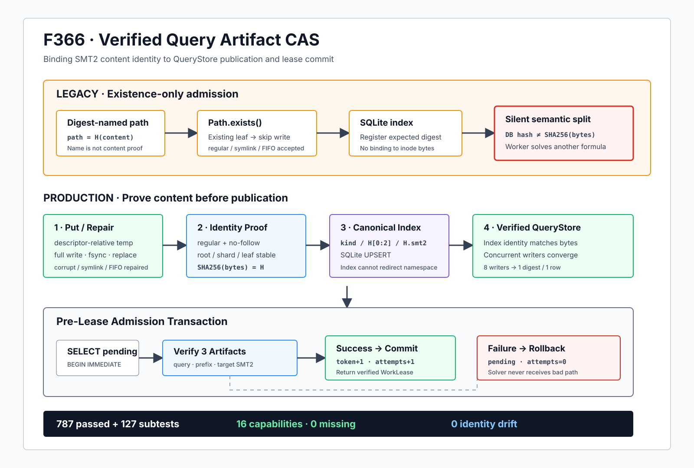

# F366：Verified Query Artifact CAS 与提交前 Lease 准入

> 日期：2026-08-11  
> 状态：实现完成，本地能力闭合门禁通过  
> 范围：Query IR 的 SMT2 artifact 持久化、读取与 worker lease 提交边界



## 1. 研究背景

F363-F365 依次完成了 Query IR 文件的有界稳定读取、spool 多消费者互斥，以及 validation、persistence、
publication 三类结果的显式分离。继续沿着 QueryStore 的持久化链审查后，发现查询元数据虽然使用 SHA-256
标识 SMT2 artifact，旧实现却没有证明“摘要路径中的文件确实具有该摘要”。

旧 `_store_artifact()` 的核心判断是：

```text
digest = SHA256(content)
path = objects/<kind>/<digest[0:2]>/<digest>.smt2
if not path.exists():
    atomic_write(path, content)
INSERT OR IGNORE artifact metadata
```

`exists()`只能证明路径解析得到某个对象，不能证明该对象是普通文件、内容等于 `content`、读取期间身份稳定，
也不能阻止最终 leaf 或祖先目录是符号链接。更重要的是，worker lease 原来先在 SQLite 中提交
`pending -> leased`，随后才解析三个 artifact 路径；一旦在路径解析或文件打开阶段失败，任务已经消耗一次
attempt 并被锁定到 TTL 到期。

## 2. 可执行反例

证据驱动器在预期摘要路径预先放入 `(assert false)`，然后按旧规则写入原本应为另一条 SMT2 的内容。旧规则
因为路径已存在而跳过写入，得到：

| 观察项 | 值 |
|---|---|
| 期望 SHA-256 | `614fe277…9eb9c305` |
| 实际 SHA-256 | `69b0c4d9…e922e3c4` |
| 实际内容 | `(assert false)` |
| 是否被静默接纳 | `true` |

这不是求解器对同一公式给出不同答案，而是 worker 根本没有求解数据库所标识的公式。该错误会污染 SAT/UNSAT
结果、prefix cache、候选输入物化和后续覆盖反馈，因而属于查询身份与执行语义之间的完整性断裂。

## 3. 目标与不变量

F366 建立以下五个可检查不变量：

1. **内容身份**：成功返回的 artifact 必须满足 `SHA256(bytes) = artifact hash`；
2. **对象类型**：CAS leaf 必须是普通文件，符号链接、FIFO 和其他特殊文件不能被当作 SMT2；
3. **命名空间身份**：root、kind shard 和 digest shard 均通过 descriptor-relative、no-follow 解析，操作结束前
   重新核对公开路径与已打开目录的身份；
4. **规范路径**：SQLite 的 `(kind, relative_path)` 必须等于由 `(kind, digest)`唯一推导的路径；
5. **Lease 故障原子性**：三个 SMT2 artifact 全部通过验证之前，不得提交 lease token、owner、TTL 或 attempts。

用状态转移表示：

```text
pending
  -- verify(query, prefix, target) succeeds --> leased(token + 1, attempts + 1)
  -- any verification fails ----------------> pending(token, attempts)
```

## 4. 方案设计

### 4.1 复用 descriptor-anchored CAS

项目在 F346-F350 已为分布式输入对象实现 `ContentAddressedInputStore`：组件级 `O_NOFOLLOW` 打开、
descriptor-relative 临时文件、完整写入与 `fsync`、原子替换、发布后 inode 身份复核、摘要验证和有界 identity
cache。F366 没有另写一套弱化的文件协议，而是把 QueryStore 的三个 artifact namespace 直接接入这一经过
故障注入验证的内核：

```text
objects/smt2/
objects/smt2-prefix/
objects/smt2-target/
```

为保持既有磁盘布局兼容，通用 CAS 新增 `full_digest_leaf=True` 模式：shard 仍取摘要前两位，leaf 保留完整
64 位摘要和 `.smt2` 后缀。默认模式不变，因此分布式输入对象继续使用去掉 shard 前缀的短 leaf。

### 4.2 Repair-before-index

`_store_artifact()` 现在先执行：

```text
store.put(content, expected_digest)
```

`put()` 对已有对象重新建立类型、身份和摘要证明；损坏 regular file、symlink 或 FIFO 会由 descriptor-anchored
临时对象安全替换，符号链接目标不会被写入。只有 CAS 返回相同摘要后，SQLite 才以 UPSERT 记录 canonical
relative path 和 size。并发正确 writer 可以收敛到同一内容，数据库保持一个 hash 主键记录。

这提供的是“正确对象先存在，再公开索引”的顺序。若 SQLite 随后失败，可能留下正确但暂时不可达的 CAS
对象；它不会让数据库指向错误内容，重试也可按摘要复用。F366 没有把该性质夸大为跨文件系统和 SQLite 的
原子事务。

### 4.3 Verify-on-access 与 identity cache

公开 `artifact_path()` 不再直接拼接数据库字符串。它依次检查：

1. digest 是小写 64 位十六进制 SHA-256；
2. `kind` 属于三个已声明 namespace；
3. `relative_path` 非绝对路径，且与 CAS 推导的绝对路径完全相等；
4. `materialize(digest, None)` 证明 leaf 是 stable regular file 且摘要匹配。

首次打开或 inode 元数据变化时需要重新流式散列；同一进程内未变化对象命中有界 identity cache，只执行目录和
inode 身份检查。进程重启后 cache 为空，第一访问会重新散列，测试已覆盖这一行为。

### 4.4 Pre-lease artifact admission

`claim()` 在 `BEGIN IMMEDIATE` 内选中候选查询后，先使用同一 SQLite snapshot 读取并验证 query、prefix、
target 三个 artifact。只有全部成功，才执行带旧 token 条件的 `UPDATE` 并提交。验证异常离开 connection
context 时触发回滚，因此不存在“artifact 不可用但任务已 leased”的中间状态。

校验位于写事务中会延长首次冷访问持锁时间，这是为了获得清晰的失败原子性。identity cache 使稳态访问不需要
重复读取完整 SMT2；真实并发吞吐影响仍需专门测量。

## 5. 执行流程

### 5.1 Ingest

```text
validated Query IR
  -> derive three SMT2 digests
  -> descriptor-anchored put / verify / repair
  -> publish canonical artifact rows
  -> commit query + witness + prefix metadata
  -> publish query JSON / candidates
```

### 5.2 Claim

```text
BEGIN IMMEDIATE
  -> select pending or expired query
  -> verify full SMT2 artifact
  -> verify prefix SMT2 artifact
  -> verify target SMT2 artifact
  -> conditional lease-token update
  -> COMMIT
  -> return WorkLease with verified paths
```

任一验证失败时，路径不会返回给 solver，lease 也不会改变。

## 6. 实现范围

| 文件 | 实现 |
|---|---|
| `util/distributed_state.py` | CAS 增加默认关闭的 `full_digest_leaf` 布局模式，复用既有发布与验证协议 |
| `util/query_store.py` | 三类 artifact store、repair-before-index、规范路径验证、verify-on-access、pre-lease admission |
| `test/test_distributed_state.py` | 完整摘要 leaf、后缀组合和非法模式类型测试 |
| `test/test_query_store.py` | 内容损坏、symlink、FIFO、路径篡改、重启复核与 lease 回滚测试 |
| `docs/codex/evidence/f366-*` | 旧反例、生产故障注入、八 writer 收敛、分层回归和完整门禁 |

既有 787 个 pytest node ID 没有增删；新断言扩展在已有测试身份内部，避免用“增加测试数量”掩盖基线替换。

## 7. 实验与验证结果

### 7.1 故障注入

| 场景 | 生产结果 |
|---|---|
| 提交前已有错误 regular file | 自动替换为期望摘要内容 |
| 提交后内容损坏 | `artifact_path()`拒绝 |
| 损坏对象参与 claim | claim 抛错，查询保持 `pending, attempts=0` |
| digest leaf 是 symlink | leaf 被替换，外部目标字节不变 |
| digest leaf 是 FIFO | 不阻塞，替换为 regular file |
| SQLite `relative_path` 为 `../../...` | 规范路径门拒绝 |
| 新 QueryStore 进程语义重开 | cache 为空时重新验证摘要并成功读取 |
| 8 个并发 writer、2 个 store 实例 | 1 个返回摘要、1 条数据库记录、0 个残留临时文件 |

### 7.2 回归门禁

| 范围 | 结果 |
|---|---|
| QueryStore + distributed state 定向 | 183 passed + 20 subtests（17.60 秒） |
| 加入 MPI lifecycle + QF_BV backend | 253 passed + 67 subtests（23.82 秒） |
| 规范 node ID 重建 | 787，字节完全相同 |
| 完整能力闭合门禁 | 787 passed + 127 subtests（115.18 秒） |
| 能力 | 10 commands + 5 Python modules + libz3，零缺失 |
| 负面结果 | 0 fail / skip / xfail / xpass / deselection / collection error |

测试清单 SHA-256 仍为：
`18596f8387a8df5af2a1ead7cc829e9c95c1bb9e699f26d916e0f1a0de833c00`。

## 8. 先进性、创新性与挑战性

F366 使用的 SHA-256 CAS、openat 风格 descriptor-relative I/O、原子 rename 和 SQLite 事务都是成熟机制，
不应宣称发明了新的内容寻址算法。其研究价值来自这些机制在并行符号执行查询生命周期中的组合：

1. **把求解身份从数据库声明提升为可执行证明**：worker 接收的公式与 Query IR 摘要在调度点闭合；
2. **把文件完整性纳入调度事务**：artifact admission 成为 lease token 提交的前置条件，而不是 solver 启动后的
   偶然 I/O 错误；
3. **兼容布局的跨子系统复用**：同一 CAS 内核同时服务分布式输入与 QueryStore SMT2，不复制竞态复杂度；
4. **可恢复而非静默容错**：有期望内容时安全修复，无期望内容时 fail closed，避免“继续运行但求解错公式”；
5. **挑战性位于跨层状态机**：目录 fd、inode identity、内容摘要、SQLite snapshot、lease fence 和并发 writer
   必须共同满足顺序约束，单独测试任一层都不足以证明整体性质。

## 9. 性能解释

本轮数据证明正确性和回归稳定性，不是性能实验。理论开销为：冷启动首次访问每个 artifact 需要一次有界流式
SHA-256；稳态命中 identity cache 时只做元数据/namespace 检查。收益是避免错误 SMT2 导致的无效 solver 时间、
错误 cache 传播和 lease TTL 浪费，但目前没有真实 solver campaign、吞吐 p50/p95/p99 或覆盖率数据，不能给出
百分比提升。

## 10. 局限与有效性威胁

1. WorkLease 仍向 subprocess 传递路径，而不是已验证文件描述符；验证返回后到 solver `open()`之间仍存在很小的
   pathname TOCTOU 窗口；
2. CAS 文件成功、SQLite 失败时可能产生正确但不可达对象，尚无 reachability scanner 和保守 GC；
3. 未在 NFS、Lustre、BeeGFS 等真实多节点共享文件系统验证 rename、fsync 和 advisory semantics；
4. query/result/generator/candidate 等其他 QueryStore 文件仍使用各自的发布路径，本轮只覆盖三个 SMT2 artifact；
5. 冷启动散列成本尚未在 128 MiB 上限和高并发 worker 条件下测量；
6. 未运行 LLVM lit、vendored QSYM/PIN、真实 MPI 多主机、公开 benchmark、LAVA-M 或覆盖率 campaign；
7. 本轮没有性能、漏洞发现数量或覆盖提升结论。

## 11. 证据与复现

- 可执行驱动：`docs/codex/evidence/f366-verified-query-artifact-cas-2026-08-11/run_verified_query_artifact_checks.py`；
- 原始反例与生产状态：同目录 `adversarial-cases.json` / `.log`；
- 测试日志：`directed-tests.log`、`affected-tests.log`、`full-gate.log`；
- 门禁结构化结果：`full-gate.json`；
- 清单重建：`inventory-rebuild.log`；
- 图示：`docs/codex/diagrams/verified-query-artifact-cas-2026-08-11.svg`；
- 完整性清单：同目录 `SHA256SUMS.txt`。

## 12. 后续工作

1. 设计基于 `O_PATH`/`/proc/self/fd` 或 stdin 传输的 solver fd handoff，闭合最后的 open-time TOCTOU；
2. 建立 SQLite 可达集合与 CAS 目录的 mark-and-sweep 审计，先只报告，再提供带 grace period 的保守 GC；
3. 将同一 verified publication primitive 推广到 query/result/generator/candidate；
4. 测量 cold hash、warm identity cache、SQLite write-lock hold time 和多 worker claim 吞吐；
5. 在真实共享文件系统和真实 solver campaign 中验证可移植性及端到端收益。

## 13. 结论

F366 修复了 QueryStore 最关键的“摘要名称不等于内容证明”错误。SMT2 artifact 现在必须经过普通文件、稳定身份、
SHA-256 和规范路径四重验证，错误对象在 ingest 时可安全修复，在无期望字节的读取/claim 时则被拒绝；三个
artifact 的验证又被前移到 lease commit 之前，使失败保持 `pending, attempts=0`。完整 787 项本地门禁零退化，
但性能、跨主机和覆盖提升仍保留为明确待验证问题。
